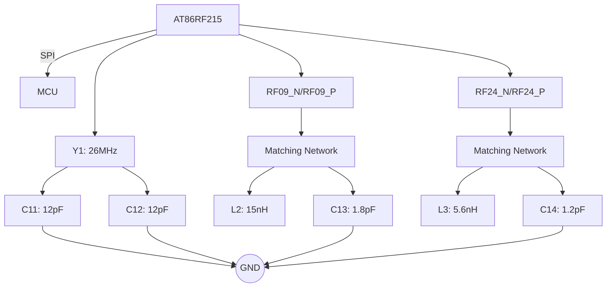

Aqui estão os nomes e números dos pinos, conforme mostrado na imagem:

1. **Pino 1**: FEA24
2. **Pino 2**: FEB24
3. **Pino 3**: AVSS
4. **Pino 4**: RFP24
5. **Pino 5**: RFN24
6. **Pino 6**: AVSS
7. **Pino 7**: AVSS
8. **Pino 8**: RFP09
9. **Pino 9**: RFN09
10. **Pino 10**: AVSS
11. **Pino 11**: FEA09
12. **Pino 12**: FEB09
13. **Pino 13**: RTSN
14. **Pino 14**: AVDD0
15. **Pino 15**: AVSS
16. **Pino 16**: TXA0
17. **Pino 17**: TXA1
18. **Pino 18**: TXA2
19. **Pino 19**: AVDD
20. **Pino 20**: CLKO
21. **Pino 21**: DVSS
22. **Pino 22**: DVDD
23. **Pino 23**: AVDD1
24. **Pino 24**: EVD1
25. **Pino 25**: MISO
26. **Pino 26**: MOSI
27. **Pino 27**: SELN
28. **Pino 28**: SCK
29. **Pino 29**: IRQ
30. **Pino 30**: DEVDS
31. **Pino 31**: DVDD
32. **Pino 32**: EXDP24
33. **Pino 33**: RXDN24
34. **Pino 34**: RXCLKP
35. **Pino 35**: RXCLKN
36. **Pino 36**: DVSS
37. **Pino 37**: RXDP09
38. **Pino 38**: RXDN09
39. **Pino 39**: DEVDD
40. **Pino 40**: TXDP
41. **Pino 41**: TXDN
42. **Pino 42**: TXCLKP
43. **Pino 43**: TXCLKN
44. **Pino 44**: AVDD1
45. **Pino 45**: AVDD2
46. **Pino 46**: AVDD3
47. **Pino 47**: AVSS
48. **Pino 48**: AVSS1
49. **Pino 49**: EP

Este componente é o **AT86RF215-ZU**.
