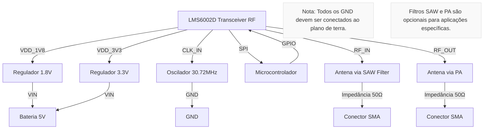
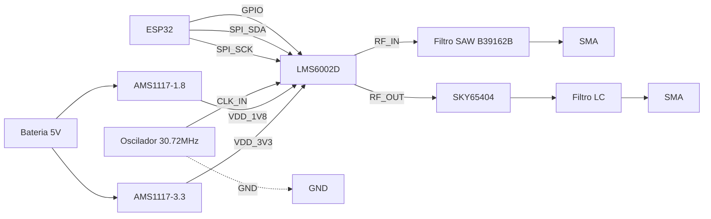

### **Esquema Elétrico do LMS6002D em Mermaid**

---

### **Checklist para Implementação em PCB**
1. **Alimentação**:
   - Use reguladores LDO (ex: **AMS1117-1.8** e **AMS1117-3.3**) com capacitores de desacoplamento (100nF + 10µF).
   - Rastreie trilhas curtas para evitar ruído.

2. **Clock**:
   - Oscilador de **30.72MHz** com capacitores de carga (12-22pF) próximos ao LMS6002D.

3. **RF**:
   - **SAW Filter** (ex: **B39162B**) na entrada RF_IN para filtrar interferências.
   - **Amplificador de Potência (PA)** na saída RF_OUT (ex: **SKY65404**).

4. **SPI**:
   - Conectar aos pinos do MCU com resistores de série (22Ω) para reduzir ringing.

5. **GND**:
   - Plano de terra contínuo sob o LMS6002D e componentes RF.

6. **Testes**:
   - Verifique a impedância (50Ω) das trilhas RF com ferramentas como **Altium** ou **KiCad**.

Abaixo está o esquema elétrico **detalhado por conexão** do **LMS6002D** para implementação em PCB, incluindo pinos críticos, valores de componentes e dicas de layout:

---

### **1. Conexões de Alimentação**
| **Pino LMS6002D** | **Descrição**          | **Circuito Recomendado**                          | **Notas**                     |
|--------------------|------------------------|--------------------------------------------------|-------------------------------|
| `VDD_1V8` (Pinos múltiplos) | Alimentação 1.8V       | Regulador LDO **AMS1117-1.8** + 10µF (tantalum) + 100nF (cerâmico) próximo ao pino | Use trilhas curtas e largas (min. 20 mils) |
| `VDD_3V3` (Pinos múltiplos) | Alimentação 3.3V       | Regulador LDO **AMS1117-3.3** + idem acima       | Separar trilhas analógicas/digitais |
| `GND`              | Terra                  | Plano de GND contínuo + vias múltiplas           | Evitar loops de GND           |

---

### **2. Clock e Controle**
| **Pino**           | **Descrição**          | **Circuito Recomendado**                          |
|--------------------|------------------------|--------------------------------------------------|
| `CLK_IN`           | Clock de referência    | Oscilador **30.72MHz** (ex: ECS-2520MVQ) + capacitores de carga (12-22pF) |
| `RESET`            | Reset (ativo baixo)    | Pull-up 10kΩ para 3.3V + capacitor 100nF        |
| `SPI_SCK`/`SPI_SDA`| Interface SPI          | Resistores de série 22Ω + pull-up 4.7kΩ (opcional) |

---

### **3. RF (Transmissão e Recepção)**
| **Pino**           | **Descrição**          | **Circuito Recomendado**                          |
|--------------------|------------------------|--------------------------------------------------|
| `RF_IN`            | Entrada RF (Rx)        | Filtro SAW **B39162B** → Acoplador DC **BLM15HD** → Conector SMA |
| `RF_OUT`           | Saída RF (Tx)          | Amplificador PA **SKY65404** → Filtro LPF (LC: 5.6nH + 1pF) → SMA |
| `TXRX_SW`          | Chaveamento Tx/Rx      | Diodo RF **HSMS-286x** + pull-down 1kΩ          |

---

### **4. Interface Digital**
| **Pino**           | **Descrição**          | **Circuito Recomendado**                          |
|--------------------|------------------------|--------------------------------------------------|
| `GPIO[0..3]`       | GPIOs configuráveis    | Resistores de pull-up/down conforme aplicação    |
| `MODE`             | Modo de operação       | Jumpers para seleção (ex: 0=SPI, 1=I2C)         |

---

### **Diagrama em Mermaid (Detalhado)**

---

### **Checklist de Layout em PCB**
1. **RF**:
   - Trilhas de **50Ω** calculadas via **KiCad PCB Calculator**.
   - Afastar trilhas RF de fontes de ruído (clock, digitais).
   - Usar vias blindadas para GND em sinais RF.

2. **GND**:
   - Plano de GND sólido na camada inferior.
   - Vias múltiplas próximas aos pinos GND do LMS6002D.

3. **Desacoplamento**:
   - Capacitores 100nF **cerâmicos** (0402) próximos a cada pino VDD.
   - Capacitor 10µF **tantalum** por regulador.

4. **Testes**:
   - Verificar continuidade com multímetro antes de energizar.
   - Usar analisador de espectro para ajuste de filtros RF.

---

### **Componentes Críticos**
| **Função**         | **Modelo Recomendado**     | **Fabricante**  |
|--------------------|----------------------------|-----------------|
| Regulador 1.8V     | AMS1117-1.8                | AMS             |
| Filtro SAW         | B39162B                    | TDK             |
| PA RF              | SKY65404                   | Skyworks        |
| Conector SMA       | SMA-Edge Mount             | Hirose          |

