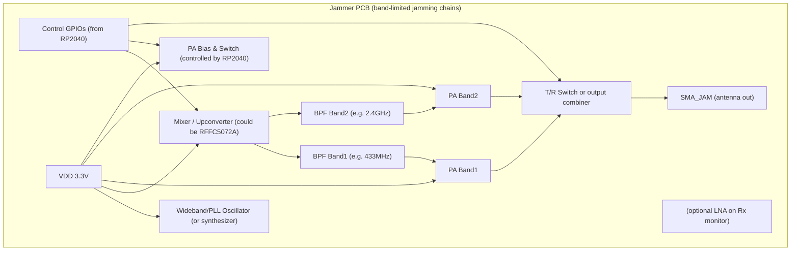
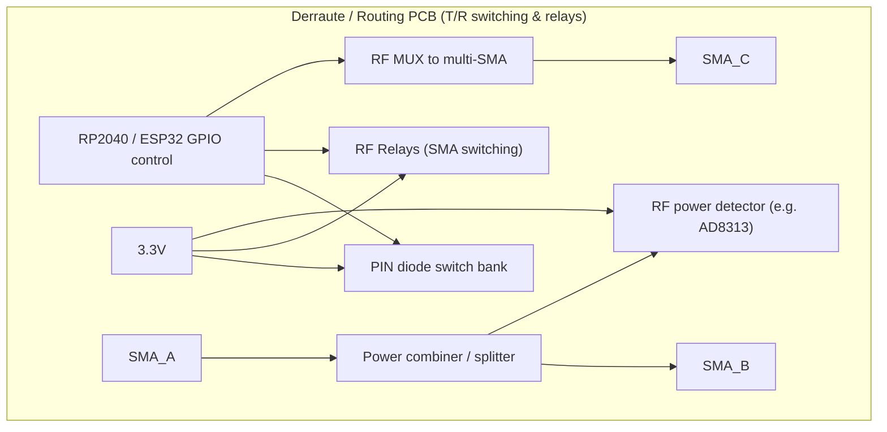
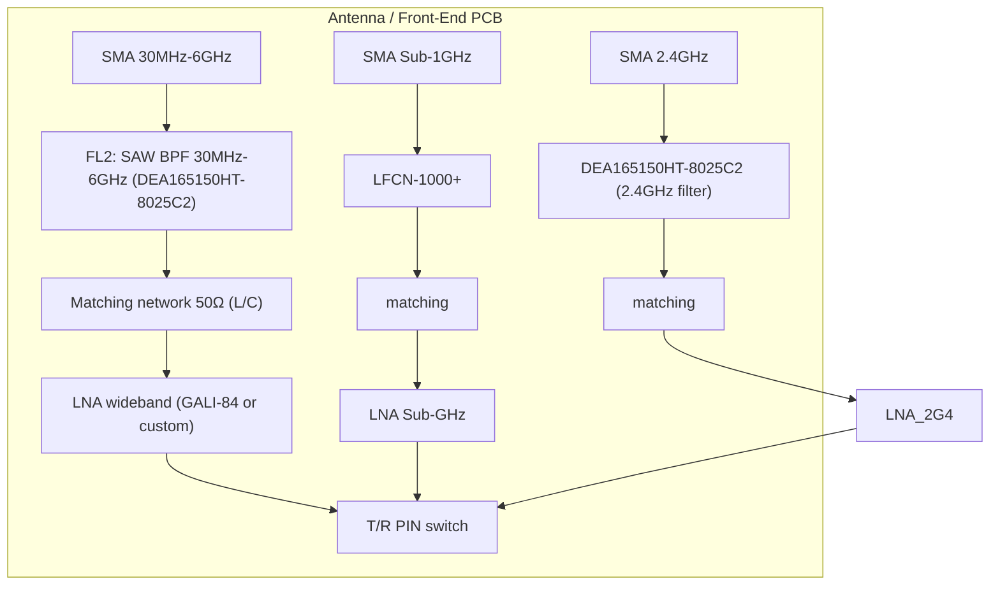
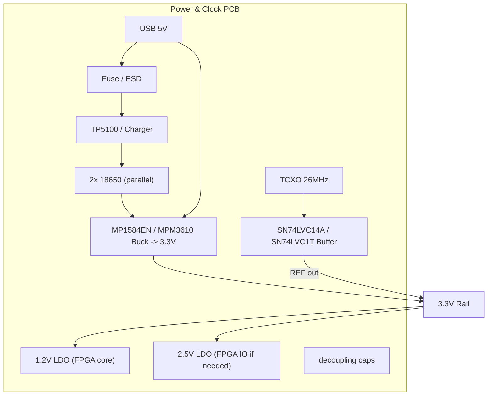

## 1) Diagrama Mermaid — **SDR PCB** (transceiver: AD9361 + FPGA + filtros + alimentação)

```mermaid
graph TB
  subgraph SDR_PCB["SDR PCB (AD9361 + FPGA + IF filters)"]
    AD9361["AD9361 (RF transceiver module)"]
    FPGA["FPGA (e.g. Artix-7)"]
    IF_AMP["IF Amplifier"]
    FL_IF["FL3: LPF 5th Order (IF)"]
    BAL_TRX["Balancer / Transformer"]
    MATCH_TX["TX Matching Network"]
    PA_TX["PA Wideband (TX PA)"]
    TX_LPF["TX Band LPF"]
    SMA_TX["SMA_OUT (TX)"]
    SMA_RX["SMA_IN (RX)"]

    %% digital / control
    SPI_CTRL["SPI_CTRL (AD9361 config)"]
    EXT_REF["REF (26MHz)"]
    PWR_3V3["VDD 3.3V"]
  end

  %% connections
  PWR_3V3 --> AD9361 & FPGA & IF_AMP
  EXT_REF --> AD9361
  AD9361 -->|IF (balanced)| FL_IF --> IF_AMP --> FPGA
  FPGA -->|LVDS/Parallel| AD9361
  AD9361 -->|TX balanced| BAL_TRX --> MATCH_TX --> PA_TX --> TX_LPF --> SMA_TX
  SMA_RX --> PA_TX  %% (T/R switch to decide direction)
```

---

## 2) Diagrama Mermaid — **Jammer PCB** (faz jamming em faixas específicas)



**Notas:** Jammer PCB normalmente contém geradores (synth), mixers, PAs e filtros por banda. Controle de potência e segurança legal é crítico — incluir detecção de chaveamento e limitação de potência.

---

## 3) Diagrama Mermaid — **Derraute PCB** (signal routing, T/R switching, relés, muxes)



---

## 4) Diagrama Mermaid — **Front-Ends / Antena PCB** (filtros por banda e antenas)



---

## 5) Diagrama Mermaid — **Power & Clock PCB**



---

## 6) Matriz proposta de **alocação de pinos** — RP2040 & ESP32

Abaixo: **proposta consolidada** para organizar os esquemas por módulo. Se não gostar, a gente refatora.

### RP2040 (lista de pinos relevantes / status)

|   Pin (GP#) | Função proposta              | Usado por qual módulo                                       |
| ----------: | ---------------------------- | ----------------------------------------------------------- |
|         GP0 | UART0 TX / SPI0 MISO         | **Control UART <-> ESP32**; also PN532 / shared SPI (SDATA) |
|         GP1 | UART0 RX / SPI0 CS           | **Control UART <-> ESP32**; SPI CS                          |
|         GP2 | SPI0 SCK                     | **SDR (RFFC SCLK)** + ESP32 SPI bridge                      |
|         GP3 | SPI0 MOSI                    | **SDR (RFFC SDATA)** + ESP32 SPI bridge                     |
|         GP4 | spare / GPIO                 | free                                                        |
|         GP5 | spare / CS                   | reserved for extra SPI CS (e.g. AT86RF215)                  |
|   GP6..GP11 | GPIO / ADC / PWM             | free / reserved                                             |
|  GP12 (XIN) | Clock input                  | **Clock Buffer -> RP2040 XIN** (SDR)                        |
| GP13 (XOUT) | Clock output                 | **Clock Buffer -> RP2040 XOUT**                             |
|   GP14,GP15 | GPIO                         | free                                                        |
|        GP16 | UART alt / GPIO              | spare (could be second UART)                                |
|        GP17 | UART alt / GPIO              | spare                                                       |
|  GP18..GP21 | GPIO / I2C (20/21 suggested) | **I2C bus: OLED, PN532 (option)** — use GP20 SDA / GP21 SCL |
|        GP22 | GPIO ctrl                    | **RFFC5072A ENBL/RESET**                                    |
|  GP23..GP25 | GPIO / ADC                   | free                                                        |
|        GP26 | ADC0                         | **IF ADC input** (IF after FL3 or IF monitor)               |
|        GP27 | ADC1                         | free                                                        |
|        GP28 | ADC2                         | free                                                        |
|  RESET\_OUT | RESET\_OUT                   | drives **ESP32 EN/Reset**                                   |

**Total RP2040 pinos marcados como *usados* nesta proposta:** 12 (GP0,GP1,GP2,GP3,GP12,GP13,GP20,GP21,GP22,GP26,RESET + maybe GP5).
**Disponíveis:** \~17 (dos 28).

---

### ESP32-S3 DevKit (pinos usados e disponíveis)

|                        Pin | Função proposta | Usado por qual módulo                                        |
| -------------------------: | --------------- | ------------------------------------------------------------ |
|                     GPIO10 | SPI CS          | connected to RP2040 GP1 (SPI CS)                             |
|                     GPIO11 | SPI MOSI        | connected to RP2040 GP3                                      |
|                     GPIO12 | SPI SCK         | connected to RP2040 GP2                                      |
|                     GPIO13 | SPI MISO        | connected to RP2040 GP0                                      |
|                     GPIO17 | UART RX         | RP2040 GP0 -> ESP32 GPIO17                                   |
|                     GPIO18 | UART TX         | RP2040 GP1 <- ESP32 GPIO18                                   |
|                         EN | EN / reset      | driven by RP2040 RESET\_OUT                                  |
| Others (GPIO0-9,14-21 etc) | many free       | available for Wi-Fi, control, or direct peripheral interface |

**Total ESP32 pinos marcados como usados:** 7
**Disponíveis:** muitos (ESP32 tem dezenas de GPIOs; você tem bastante margem para funcionalidades Wi-Fi, USB host, etc).

---

## 7) Diagrama de Conexão Geral (como juntar as PCBs)

```mermaid
graph LR
  subgraph MAIN["System Integration - top view"]
    POWER["Power PCB"] --> SDR_PCB
    POWER --> JAMMER_PCB
    POWER --> DEROUTE_PCB
    POWER --> ANT_PCB
    POWER --> CTRL_PCB[Control (RP2040 / ESP32)]
  end

  CTRL_PCB -->|SPI / UART / GPIO| SDR_PCB
  CTRL_PCB -->|GPIO / Bias| JAMMER_PCB
  CTRL_PCB -->|GPIO| DEROUTE_PCB
  SDR_PCB -->|IF/RF| DEROUTE_PCB
  DEROUTE_PCB -->|switched| ANT_PCB
```

---

