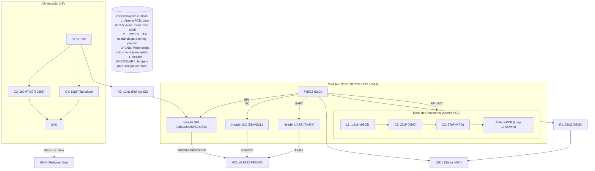

# 📡 Módulo PN532 NFC - Guia de Montagem em PCB

*Solução completa NFC para aplicações 13.56MHz*

## 📦 Lista de Materiais (BOM)

| Ref    | Componente | Especificações           | Qtd |
| ------ | ---------- | ------------------------ | --- |
| U1     | CI PN532   | Controlador NFC 13.56MHz | 1   |
| L1     | Indutor    | 1.5µH 0805 ±1%           | 1   |
| C1, C2 | Capacitor  | 27pF NPO 0805            | 2   |
| C3     | Capacitor  | 100nF X7R 0805           | 1   |
| C4     | Capacitor  | 10µF Tântalo             | 1   |
| R1     | Resistor   | 220Ω 0805                | 1   |
| R2     | Resistor   | 10kΩ 0805                | 1   |
| LED1   | LED        | 0805 SMD (Vermelho)      | 1   |
| J1     | Conector   | 2x4 Pinos 2.54mm         | 1   |

## 🛠 Instruções de Montagem

### 1. Preparação da PCB

* Limpeza da placa com álcool isopropílico.
* Verifique se todos os pads estão livres de oxidação.

### 2. Componentes SMD (Perfil de Reflow Recomendado)

1. **Aplicação de pasta**: Estêncil de 0.1mm de espessura.
2. **Pick & Place**: Coloque os componentes 0402 primeiro.
3. **Reflow**:

   * Pré-aquecimento: 2°C/s até 150°C.
   * Soak: 60 segundos a 180°C.
   * Pico: 30 segundos a 230°C.
   * Resfriamento: Máximo 3°C/s.

### 3. Montagem da Antena (Passo Crítico!)

* **Desenho da Antena**:

  * Loop de 3-5 espirais, 1mm de largura.
  * Espaçamento entre trilhas: 0.5mm.
  * Diâmetro total: \~50mm.
* **Dicas**:

  * Use cálculos de indutância para ajustar C1/C2.
  * Mantenha área sólida de GND sob a antena para garantir um bom desempenho.

### 4. Soldagem dos Componentes Convencionais

1. Comece pelos componentes mais baixos, como os resistores.
2. Em seguida, monte os componentes mais altos, como os conectores.
3. Verifique cuidadosamente por pontes de solda com lupa.

### 🔧 Ajuste e Teste

1. **Tuning da Antena**:

   * Use um analisador de rede para ajustar os capacitores C1 e C2.
   * Frequência alvo: 13.56MHz ±0.5MHz.

2. **Teste Funcional**:

```bash
# Comando básico para teste (Linux)
nfc-poll
```

* Distância de leitura esperada: 3-5cm com cartão NFC.

## ⚠️ Problemas Comuns e Soluções

| Problema              | Solução                      |
| --------------------- | ---------------------------- |
| Leitura curta         | Ajuste C1/C2 ou verifique L1 |
| Não detecta           | Confira soldas do CI PN532   |
| Aquecimento excessivo | Verifique curto nos 3.3V     |

---

## 📚 Conexões e Fluxo do Sistema

Aqui está um diagrama atualizado das conexões para a montagem correta:



## 📈 Orçamento Estimado

Aqui está uma estimativa aproximada dos custos dos componentes principais para a montagem de uma unidade:

| Componente           | Estimativa de Custo (R\$) |
| -------------------- | ------------------------- |
| CI PN532             | 45,00                     |
| Indutor (L1)         | 2,00                      |
| Capacitores (C1, C2) | 1,50                      |
| Capacitor (C3)       | 1,00                      |
| Capacitor (C4)       | 2,00                      |
| Resistores (R1, R2)  | 0,50                      |
| LED1                 | 1,50                      |
| Conector (J1)        | 3,00                      |
| **Total Aproximado** | **56,50**                 |

Este orçamento é apenas uma estimativa e pode variar dependendo do fornecedor.

