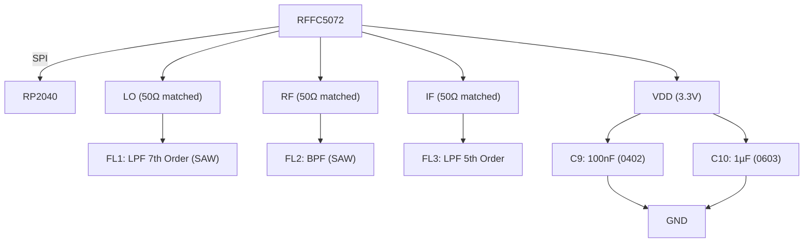

```mermaid
graph TD
    RFFC5072 -->|SPI| RP2040
    RFFC5072 --> LO_IN["LO (50Ω matched)"]
    RFFC5072 --> RF_IN["RF (50Ω matched)"]
    RFFC5072 --> IF_OUT["IF (50Ω matched)"]
    
    LO_IN --> FL1["FL1: LPF 7th Order (SAW)"]
    RF_IN --> FL2["FL2: BPF (SAW)"]
    IF_OUT --> FL3["FL3: LPF 5th Order"]
    
    RFFC5072 --> VDD["VDD (3.3V)"]
    VDD --> C9["C9: 100nF (0402)"]
    VDD --> C10["C10: 1µF (0603)"]
    C9 --> GND
    C10 --> GND
```