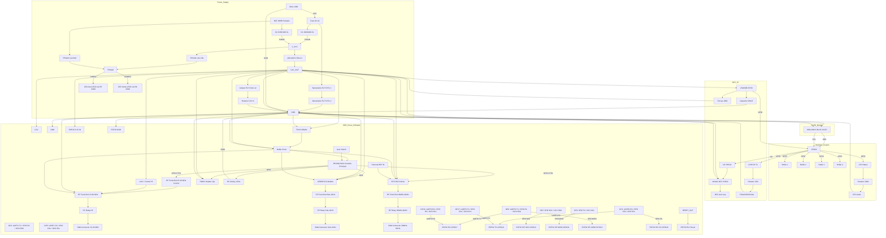

```mermaid
graph TD
    %% =============================
    %% ALIMENTAÇÃO
    %% =============================
    subgraph Power_Supply
        A[Micro USB] -->|VCC| B["Fuse 3A U4"]
        B --> C[D1 1N5819W SL]
        C -->|Catodo| D[V_SYS]
        E[BAT 18650 Paralelo] --> F[D2 1N5819W SL]
        F -->|Catodo| D
        D --> G[LDO MCP1700-3.3]
        G --> H[3.3V_OUT]
        H --> I[Jumper P2 H-Fem-12]
        I --> J[Sistema 3.3V In]
        B --> K[Barramento 5V P2 Pin 1]
        K --> L[Barramento 5V P2 Pin 2]
        L --> M[GND]
        D --> N[TP5100 U12 VIN]
        E --> O[TP5100 U12 BAT]
        N --> P[TP5100]
        O --> P
        P -->|CHRG#| Q[LED Azul LED2 via R5 330Ω]
        P -->|STDBY#| R[LED Verde LED1 via R6 330Ω]
        A -->|GND| M
        H --> M
        J --> M
    end

    %% =============================
    %% INTERFACE DE USUÁRIO
    %% =============================
    subgraph Interface_Usuario
        STM32 -->|GPIO| BTN1["Botão 1"]
        STM32 -->|GPIO| BTN2["Botão 2"]
        STM32 -->|GPIO| BTN3["Botão 3"]
        STM32 -->|GPIO| BTN4["Botão 4"]
        STM32 -->|GPIO| LED_CTRL["LED Status"]
        LED_CTRL --> LED_RES["Resistor 330Ω"]
        LED_RES --> LED["LED Verde"]
        LED --> M
    end

    %% =============================
    %% OLED DISPLAY
    %% =============================
    subgraph OLED_Module
        H --> OLED["SSD1306 0.96 I2C OLED"]
        OLED -->|SDA| STM32
        OLED -->|SCL| STM32
        M --> OLED
    end

    %% =============================
    %% NFC + IR
    %% =============================
    subgraph NFC_IR
        STM32 -->|I2C| PN532_I2C["I2C PN532"]
        PN532_I2C --> PN532["Módulo NFC PN532"]
        PN532 --> LOOP_ANT["NFC Ant Loop"]
        H --> PN532
        M --> PN532

        STM32 -->|GPIO| IR_TX["GPIO IR TX"]
        IR_TX --> R_IR["Resistor 33Ω"]
        R_IR --> IR_EMITTER["TSAL6200 Emitter"]
        IR_EMITTER --> M

        IR_RX["VS1838B IR RX"] -->|GPIO| STM32
        IR_RX --> R_PULLUP["Pull-up 10kΩ"]
        R_PULLUP --> H
        IR_RX --> C_IR["Capacitor 100nF"]
        C_IR --> M
        H --> IR_RX
    end

    %% =============================
    %% SDR CLONE REFINADO (RP2040) - Detalhado
    %% =============================
    subgraph SDR_Clone_Refinado
        %% -----------------------------
        %% MCU Principal
        RP2040["RP2040 MCU Controle Principal"]
        H --> RP2040_VCC["3.3V"]
        M --> RP2040_GND["GND"]

        %% ====================
        %% Pinos do RP2040 utilizados
        %% ====================
        RP2040_GP0["GP0: UART0 TX / SPI0 RX / I2C0 SDA"]
        RP2040_GP1["GP1: UART0 RX / SPI0 CSn / I2C0 SCL"]
        RP2040_GP2["GP2: SPI0 SCK / I2C1 SDA"]
        RP2040_GP3["GP3: SPI0 TX / I2C1 SCL"]
        RP2040_GP4["GP4: UART1 TX / SPI0 RX / I2C0 SDA"]
        RP2040_GP5["GP5: UART1 RX / SPI0 CSn / I2C0 SCL"]
        RP2040_GP16["GP16: UART0 RX / SPI0 RX / I2C0 SCL"]
        RP2040_GP17["GP17: UART0 TX / SPI0 CSn / I2C0 SCL"]

        %% -----------------------------
        %% Controladores de faixa
        RP2040 -->|SPI0| MODEM["AT86RF215 Modem"]
        RP2040 -->|GPIO CTRL| MIXER["RFFC5072 Mixer"]
        RP2040 -->|GPIO CTRL| HF_FRONTEND_CTRL["HF Front-End 15-30 MHz Control"]

        %% ====================
        %% Front-Ends RF
        MODEM --> RF_SUB1G["RF Front-End Sub-1GHz"]
        MIXER --> RF_6GHz["RF Front-End 30MHz-6GHz"]
        HF_FRONTEND_CTRL --> HF_FRONTEND["HF Front-End 15-30 MHz"]

        %% Relés RF
        HF_RELAY["RF Relay HF"] --> SMA_HF["SMA Connector 15-30 MHz"]
        SUB1G_RELAY["RF Relay Sub-1GHz"] --> SMA_SUB1G["SMA Connector Sub-1GHz"]
        MIXER_RELAY["RF Relay 30MHz-6GHz"] --> SMA_6GHz["SMA Connector 30MHz-6GHz"]

        RF_SUB1G --> SUB1G_RELAY
        RF_6GHz --> MIXER_RELAY
        HF_FRONTEND --> HF_RELAY

        %% Alimentação filtrada para HF
        H --> LDO_HF["LDO + Ferrite HF"]
        LDO_HF --> HF_FRONTEND
        M --> HF_FRONTEND

        %% Alimentação restante
        H --> MODEM
        H --> MIXER
        M --> MODEM
        M --> MIXER

        %% Clock
        TCXO["TCXO 26MHz"] --> CLK_BUFFER["Buffer Clock"]
        CLK_BUFFER --> RP2040
        CLK_BUFFER --> MODEM
        CLK_BUFFER --> MIXER
        CLK_BUFFER --> HF_FRONTEND
        H --> TCXO
        M --> TCXO
        H --> CLK_BUFFER
        M --> CLK_BUFFER
        EXT_CLK["External REF IN"] --> MIXER

        %% Interfaces extras
        RP2040 -->|GPIO| PMOD["PMOD Header 12p"]
        H --> PMOD
        M --> PMOD

        RP2040 --> LED_STATUS["RF Activity LEDs"]
        LED_STATUS -->|330Ω| M

        USER_SW["User Switch"] --> RP2040

        %% ====================
        %% Integração com ESP32-S3 (Wi-Fi / BT)
        %% ====================
        RP2040_GP0 -->|UART0 TX| ESP32_RX["ESP32 RX GPIO17"]
        RP2040_GP1 -->|UART0 RX| ESP32_TX["ESP32 TX GPIO18"]
        RP2040_GP16 -->|UART0 RX| ESP32_RX
        RP2040_GP17 -->|UART0 TX| ESP32_TX

        RP2040_GP2 -->|SPI0 SCK| ESP32_SCK["ESP32 SPI SCK GPIO12"]
        RP2040_GP3 -->|SPI0 MOSI| ESP32_MOSI["ESP32 SPI MOSI GPIO11"]
        RP2040_GP0 -->|SPI0 MISO| ESP32_MISO["ESP32 SPI MISO GPIO13"]
        RP2040_GP1 -->|SPI0 CS| ESP32_CS["ESP32 SPI CS GPIO10"]

        RP2040_RST["RESET_OUT"] --> ESP32_EN["ESP32 EN / Reset"]

        %% Alimentação para ESP32
        H --> ESP32_VCC["ESP32 3.3V IN"]
        M --> ESP32_GND["ESP32 GND"]
    end
```