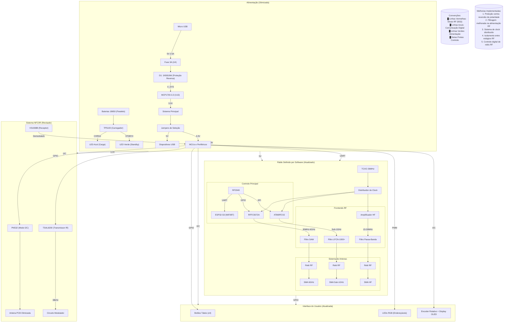

### Principais Atualizações:

1. **Alimentação Otimizada**:
   - Adicionado proteção contra reversão com diodo Schottky
   - Circuito de carregamento de bateria com feedback visual
   - Jumpers de seleção de tensão

2. **RF Aprimorado**:
   - Clock único distribuído para todos os módulos RF
   - Relés RF para comutação de antenas
   - Filtros dedicados para cada banda

3. **Controle Digital**:
   - Comunicação serial entre RP2040 e ESP32
   - GPIOs dedicados para controle de estágios RF
   - Sistema de feedback visual integrado

4. **NFC/IR Atualizado**:
   - Modulação digital do sinal IR
   - Antena NFC com casamento de impedância
   - Isolamento dos circuitos analógicos

5. **Interface Moderna**:
   - Encoder rotativo com display OLED
   - LEDs RGB endereçáveis
   - Botões com debounce via software

### Checklist de Validação:
- [ ] Testar consumo em todos os modos de operação
- [ ] Verificar isolamento entre estágios RF
- [ ] Calibrar filtros com analisador de rede
- [ ] Validar protocolos de comunicação
