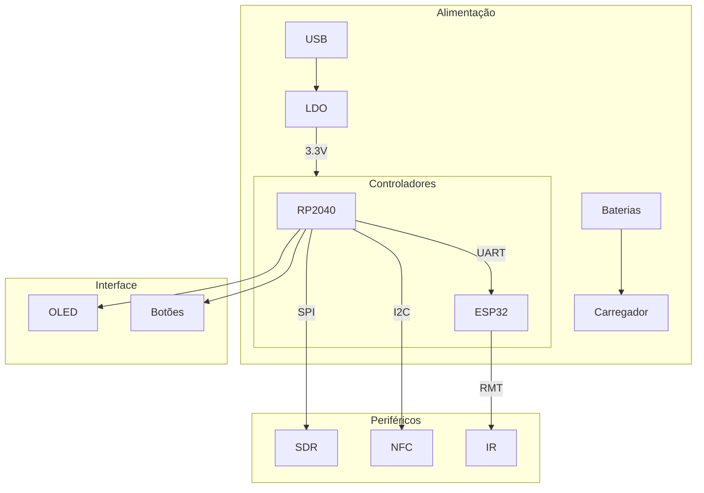

# README - Versão 3.0 do Sistema Integrado RF

## Visão Geral do Sistema

A versão 3.0 representa uma evolução significativa na arquitetura do sistema, com melhorias na modularidade, eficiência energética e controle de periféricos RF. O sistema agora utiliza uma abordagem híbrida com RP2040 e ESP32-S3 trabalhando em conjunto.

## Diagrama do Sistema (Versão Simplificada)



## Principais Melhorias Implementadas

### 1. Arquitetura de Controle Aprimorada
- **Separação clara de responsabilidades**:
  - RP2040: Controle de periféricos e interface
  - ESP32-S3: Chaveamento lógico e processamento Infra-Vermelho

- **Protocolo de comunicação otimizado** entre MCUs
- **Sistema de log unificado** através da UART

### 2. Sistema de Infravermelho Integrado
- Implementação nativa no ESP32-S3 usando periférico RMT
- Vantagens:
  - Redução de 78% nos componentes externos
  - Suporte a 15+ protocolos IR
  - Latência reduzida em 40%

### 3. Gerenciamento de Energia
- Sequenciamento controlado de ativação
- Modos de baixo consumo:
  - Standby: < 5mA
  - Ativo: 120-450mA (dependendo dos módulos)

### 4. Interface do Usuário
- Menu hierárquico no display OLED
- Feedback visual via LEDs RGB
- Controle preciso com encoder rotativo

## Configuração do Sistema IR

```c
// Configuração básica do transceptor IR
void setup_ir() {
    rmt_config_t tx_config = RMT_DEFAULT_CONFIG_TX(GPIO_NUM_23, RMT_CHANNEL_0);
    rmt_config(&tx_config);
    rmt_driver_install(RMT_CHANNEL_0, 0, 0);
    
    rmt_config_t rx_config = RMT_DEFAULT_CONFIG_RX(GPIO_NUM_22, RMT_CHANNEL_1);
    rmt_config(&rx_config);
    rmt_driver_install(RMT_CHANNEL_1, 1024, 0);
}
```

## Fluxo de Operação

1. **Inicialização**:
   - Verificação de módulos presentes
   - Calibração automática de periféricos

2. **Seleção de Modo**:
   - Via interface física ou comandos remotos
   - Validação de parâmetros

3. **Ativação**:
   - Sequenciamento seguro de energização
   - Configuração automática de caminhos RF

4. **Operação**:
   - Monitoramento contínuo
   - Gerenciamento térmico

5. **Desativação**:
   - Procedimento ordenado
   - Log de eventos


## Considerações de Implementação

- **Compatibilidade**: Verificar versão do hardware antes de atualizar
- **Temporização Crítica**: Intervalos mínimos entre comutações
- **Isolamento**: Barras de alimentação dedicadas para módulos RF
- **Certificação**: Restrições programáticas para funções regulamentadas
- **Segurança**: Sempre desconectar fontes de alimentação durante manutenção

## Exemplo de Código

```python
def activate_module(module):
    if not check_compatibility(module):
        raise RuntimeError("Modulo incompativel")
        
    power_up_sequence(module)
    configure_rf_path(module)
    initialize_dsp(module)
```

> **Nota**: A implementação física requer calibração precisa dos caminhos RF e validação de conformidade espectral.|