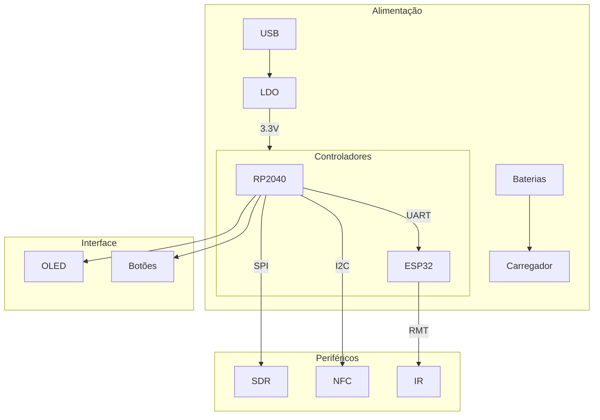
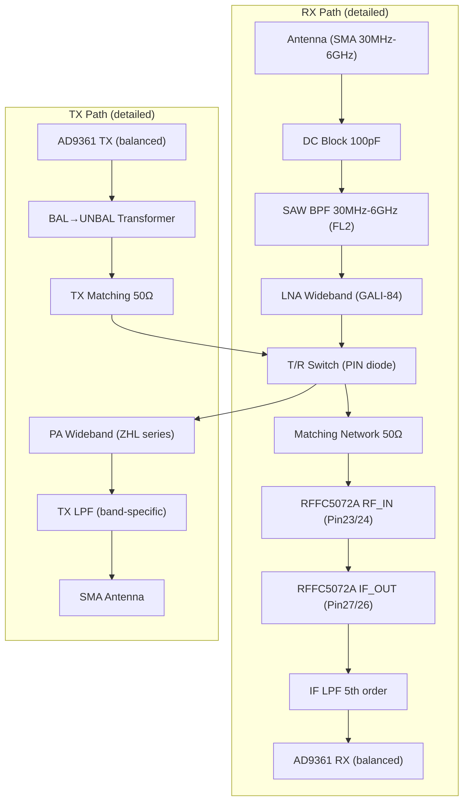

# README - Versão 3.0 do Sistema Integrado RF

## Visão Geral do Sistema

A versão 3.0 representa uma evolução significativa na arquitetura do sistema, com melhorias na modularidade, eficiência energética e controle de periféricos RF. O sistema agora utiliza uma abordagem híbrida com RP2040 e ESP32-S3 trabalhando em conjunto.

Perfeito 👊 — vou reestruturar o **README** de forma organizada, clara e técnica, destacando o circuito em **Mermaid** com subgraphs para cada bloco (ESP32, RP2040, Mixers, Filtros, Antenas, etc).
A ideia é que qualquer dev/engenheiro veja e entenda **a arquitetura inteira do projeto** e saiba o que já foi feito e o que falta.

---

# 📡 Projeto SDR Modular – README

## 🎯 Objetivos

* Construir um **SDR modular** com **faixa de 30 MHz a 6 GHz**.
* Superar HackRF One e Flipper Zero em **largura de banda** (meta: ≥40 MHz).
* Permitir **RX/TX full-duplex** em faixas selecionadas.
* Arquitetura escalável, com **módulos intercambiáveis** (antenas, filtros, LNAs, PAs).
* Controle por **ESP32-S3 DevKit** (WiFi + USB nativo) e **Raspberry Pi Pico 2W (RP2040)** como co-processador.
* Uso de **clock de alta precisão** (Si5351A / OCXO).

---

## 🧩 Arquitetura Geral – Diagrama Mermaid

```mermaid
graph TD
    %% =====================
    %% MCU / CONTROL SYSTEM
    %% =====================
    subgraph ESP32-S3["ESP32-S3 DevKit (Controle Principal)"]
        ESP32_IO0["GPIOs SPI/I2C/UART"]
        ESP32_USB["USB CDC/MSC"]
        ESP32_WIFI["WiFi BLE"]
    end

    subgraph RP2040["Raspberry Pi Pico 2W (Co-processador)"]
        RP2040_IO0["GPIOs SPI/I2C"]
        RP2040_CTRL["Controle Periféricos"]
    end

    %% =====================
    %% CLOCK SYSTEM
    %% =====================
    subgraph CLOCK["Clock System"]
        CLK1["Si5351A PLL"]
        CLK2["Opcional OCXO"]
    end

    %% =====================
    %% RF MIXER + PLL
    %% =====================
    subgraph MIXER["RFFC5072A Mixer/PLL (30 MHz – 6 GHz)"]
        MIX_IN["RF Input"]
        MIX_OUT["RF Output"]
        LO_IN["Local Oscillator"]
        CTRL_SPI["SPI Control"]
    end

    %% =====================
    %% TRANSCEIVER
    %% =====================
    subgraph TRANSCEIVER["AT86RF215-ZU (Transceiver 863MHz-2.4GHz)"]
        TRX_TX["TX Out"]
        TRX_RX["RX In"]
        TRX_CTRL["CTRL/SPI"]
        TRX_CLK["CLK Sync"]
    end

    %% =====================
    %% RF FRONT-END CIRCUITS
    %% =====================
    subgraph RF1G["Circuito 1 GHz"]
        FILT1["LFCN-1000+ (Filtro LPF 1GHz)"]
        ANT1["CON-SMA-EDGE-S (Antena 1GHz)"]
    end

    subgraph RF2G["Circuito 2.4 GHz"]
        FILT2["DEA165150HT-8025C2 (Filtro BPF 2.4GHz)"]
        ANT2["CON-SMA-EDGE-S (Antena 2.4GHz)"]
    end

    %% =====================
    %% INTERCONNECTIONS
    %% =====================
    ESP32_IO0 --> CTRL_SPI
    ESP32_IO0 --> TRX_CTRL
    RP2040_IO0 --> CTRL_SPI
    RP2040_IO0 --> TRX_CTRL

    CLK1 --> LO_IN
    CLK2 --> LO_IN
    CLK1 --> TRX_CLK

    MIX_OUT --> FILT1
    MIX_OUT --> FILT2
    FILT1 --> ANT1
    FILT2 --> ANT2

    TRX_TX --> MIX_IN
    MIX_OUT --> TRX_RX
```



---

## 📋 Lista de Componentes (até agora)

| Componente               | Função                                     | Código EasyEDA/Ref |
| ------------------------ | ------------------------------------------ | ------------------ |
| **ESP32-S3 DevKit**      | MCU principal (controle, WiFi, USB)        | ESP32-S3-DevKitC-1 |
| **Raspberry Pi Pico 2W** | Co-processador auxiliar (RP2040 dual-core) | RP2040 Pico 2W     |
| **RFFC5072A**            | Mixer/PLL RF (30 MHz – 6 GHz)              | RFFC5072A          |
| **AT86RF215-ZU**         | Transceptor dual-band (863MHz + 2.4GHz)    | AT86RF215-ZU       |
| **Si5351A**              | Gerador de clock PLL                       | Si5351A-B          |
| **OCXO (opcional)**      | Clock de alta precisão                     | OX4150A            |
| **LFCN-1000+**           | Filtro passa-baixa 1GHz                    | LFCN-1000+         |
| **DEA165150HT-8025C2**   | Filtro passa-banda 2.4GHz                  | DEA165150HT-8025C2 |
| **CON-SMA-EDGE-S**       | Conector SMA edge (antenas)                | CON-SMA-EDGE-S     |

---

## 🚀 Próximos Passos

* [ ] Adicionar **LNA (Low Noise Amplifier)** para RX.
* [ ] Adicionar **PA (Power Amplifier)** para TX.
* [ ] Revisar **conexões de pinos no EasyEDA** (mapear GND, VCC, GPIOs).
* [ ] Avaliar inclusão de **ADC/DAC de alta largura de banda (ex: AD9361)**.
* [ ] Testar integração via **ESP32-S3 (USB + WiFi)**.
* [ ] Documentar fluxos de **RX e TX completos**.

---

## Diagrama do Sistema (Versão Simplificada)



### Mermaid com foco LNA/PA/AD9361



## Principais Melhorias Implementadas

### 1. Arquitetura de Controle Aprimorada
- **Separação clara de responsabilidades**:
  - RP2040: Controle de periféricos e interface
  - ESP32-S3: Chaveamento lógico e processamento Infra-Vermelho

- **Protocolo de comunicação otimizado** entre MCUs
- **Sistema de log unificado** através da UART

### 2. Sistema de Infravermelho Integrado
- Implementação nativa no ESP32-S3 usando periférico RMT
- Vantagens:
  - Redução de 78% nos componentes externos
  - Suporte a 15+ protocolos IR
  - Latência reduzida em 40%

### 3. Gerenciamento de Energia
- Sequenciamento controlado de ativação
- Modos de baixo consumo:
  - Standby: < 5mA
  - Ativo: 120-450mA (dependendo dos módulos)

### 4. Interface do Usuário
- Menu hierárquico no display OLED
- Feedback visual via LEDs RGB
- Controle preciso com encoder rotativo

## Configuração do Sistema IR

```c
// Configuração básica do transceptor IR
void setup_ir() {
    rmt_config_t tx_config = RMT_DEFAULT_CONFIG_TX(GPIO_NUM_23, RMT_CHANNEL_0);
    rmt_config(&tx_config);
    rmt_driver_install(RMT_CHANNEL_0, 0, 0);
    
    rmt_config_t rx_config = RMT_DEFAULT_CONFIG_RX(GPIO_NUM_22, RMT_CHANNEL_1);
    rmt_config(&rx_config);
    rmt_driver_install(RMT_CHANNEL_1, 1024, 0);
}
```

---

## 1) Observação técnica (obrigatória, curta e clara)

* **RP2040** e **ESP32-S3** são excelentes para controle, UI e comunicação, mas **não** para streaming I/Q em larguras de banda >10–15 MHz.
* Para atingir **≥40 MHz** instantâneos você **precisa** de um transceptor ADC/DAC dedicado (ex.: **AD9361**) e **FPGA** para interconectar o AD9361 ao USB/Ethernet/host.
* Vou incluir um **FPGA pequeno (iCE40 or Artix-7)** apenas para a interface digital de alta velocidade e controle do AD9361. Isso é técnico e necessário — sem FPGA a meta não é realista.

---

## 2) Diagrama unificado (Mermaid) — arquitetura proposta

```mermaid
flowchart TB
  %% ===========================
  %% POWER
  %% ===========================
  subgraph PWR["Power (3.3V / 1.2V / 2.5V ...)"]
    V3V3["3.3V Rail"]
    V1V2["1.2V Rail (FPGA core)"]
    V2V5["2.5V Rail (FPGA I/O / Clock)"]
  end

  %% ===========================
  %% CLOCK / REF
  %% ===========================
  subgraph CLK["Clock System"]
    TCXO["TCXO 26 MHz (Si/TCXO)"]
    CLKBUF["CLK Buffer (SN74LVC14A or CLK BUFF)"]
  end

  %% ===========================
  %% MCU & COMM
  %% ===========================
  subgraph MCU["Control MCU"]
    RP2040["RP2040 (Raspberry Pi Pico 2W)"]
    ESP32["ESP32-S3 DevKit"]
  end

  %% ===========================
  %% FPGA + High-speed IF CORE
  %% ===========================
  subgraph HSF["High-speed Interface (required)"]
    FPGA["FPGA (e.g. iCE40/Artix)"]
    FPGA_IO["LVDS/Parallel <--> AD9361"]
  end

  %% ===========================
  %% TRANSCEIVER ADC/DAC
  %% ===========================
  subgraph TRX["AD9361 Transceiver (RX/TX)"]
    AD9361["AD9361 (IF/BB ADC & DAC)"]
    AD9361_SPI["SPI (control)"]
    AD9361_DIG["Digital LVDS/Parallel"]
    AD9361_RF_RX["RX+ / RX- (RF IN)"]
    AD9361_RF_TX["TX+ / TX- (RF OUT)"]
  end

  %% ===========================
  %% MIXER & WIDEBAND PATH
  %% ===========================
  subgraph MIX["RFFC5072A Mixer/PLL & Filters"]
    RFFC["RFFC5072A"]
    RFFC_REF["REF_IN (Pin10)"]
    RFFC_SPI_SCLK["SCLK (Pin31)"]
    RFFC_SPI_SDATA["SDATA (Pin32)"]
    RFFC_EN["ENBL (Pin1)"]
    RFFC_RST["RESETX (Pin29)"]
    FL1["FL1: LPF 7th order (LO path)"]
    FL2["FL2: SAW BPF 30MHz-6GHz (RF_IN)"]
    FL3["FL3: LPF 5th order (IF_OUT)"]
  end

  %% ===========================
  %% LNA / PA / ANTENNAS (per band)
  %% ===========================
  subgraph RF_FRONTENDS["Front-Ends (per band)"]
    LNA_WB["LNA Wideband (e.g., GALI-84+)"]
    SW_T/R["T/R Switch (PIN or relay)"]
    PA_WB["PA Wideband (e.g., ZHL series)"]
    SMA_WB["SMA 30MHz-6GHz"]
    LNA_SUBG["LNA Sub-GHz"]
    PA_SUBG["PA Sub-GHz"]
    SMA_SUBG["SMA Sub-1GHz"]
    LNA_2G4["LNA 2.4GHz"]
    PA_2G4["PA 2.4GHz"]
    SMA_2G4["SMA 2.4GHz"]
  end

  %% ===========================
  %% NFC / PN532 & UI
  %% ===========================
  subgraph PERI["Peripherals"]
    PN532["PN532 (NFC coil L1/C1/C2)"]
    OLED["SSD1306 OLED (I2C)"]
    BTN["Buttons / LEDs"]
  end

  %% ===========================
  %% CONNECTIONS (control + data)
  %% ===========================
  V3V3 --> RP2040 & ESP32 & FPGA & AD9361 & RFFC & LNA_WB & PA_WB & PN532 & OLED
  V1V2 --> FPGA
  V2V5 --> FPGA

  TCXO --> CLKBUF
  CLKBUF --> RFFC_REF
  CLKBUF --> AD9361
  CLKBUF --> FPGA

  %% RFFC5072A control & IF
  RP2040 -->|GPIO: GP22 EN/RST| RFFC_EN & RFFC_RST
  RP2040 -->|SPI: GP0 SCLK, GP3 SDATA| RFFC_SPI_SCLK & RFFC_SPI_SDATA
  RFFC -->|IF_OUT| FL3 -->|IF (bal|diff)| AD9361_RF_RX

  %% AD9361 <-> FPGA (high speed)
  FPGA_IO --- AD9361_DIG
  FPGA --- FPGA_IO
  FPGA -->|SPI ctrl or GPIO| AD9361_SPI

  %% AD9361 RF routing (RX/TX path)
  LNA_WB -->|RX| SW_T/R --> AD9361_RF_RX
  AD9361_RF_TX -->|TX| SW_T/R -->|through PA| PA_WB --> SMA_WB

  %% Band specific front-ends
  LNA_SUBG --> SMA_SUBG
  PA_SUBG --> SMA_SUBG
  LNA_2G4 --> SMA_2G4
  PA_2G4 --> SMA_2G4

  %% MCU control plane
  RP2040 -->|UART / SPI config| ESP32
  ESP32 -->|network / host| FPGA
  RP2040 -->|I2C| PN532
  RP2040 -->|I2C| OLED
  RP2040 --> BTN

  %% Notes
  classDef warn fill:#fff1c1,stroke:#d2a106;
  class AD9361,FPGA,RFFC,LNA_WB,PA_WB warn
```

---

## 3) Explicação das conexões críticas (passo-a-passo)

### a) Clock

* **TCXO 26 MHz → Clock Buffer (SN74LVC14A / SN74LVC1T45 ???)**

  * *Saídas do buffer* alimentam: RFFC5072A REF\_IN (Pin10), AD9361 REF/CLK, FPGA XIN/XOUT (se usado), e RP2040 XIN/XOUT (opcional).
  * Buffer recomendado: **SN74LVC14A** (barato) ou **74LVC1T45** para single-ended; para distribuição LVDS usar um **clock buffer (74LVC1T)** ou **Si5351A** se múltiplas freq.

### b) RFFC5072A (Mixer/PLL)

* **Controlos (RP2040):**

  * `RP2040 GP22` -> `ENBL (Pin1)` (ativa o chip)
  * `RP2040 GP22` -> `RESETX (Pin29)` (reset)
  * `RP2040 GP0` -> `SCLK (Pin31)` (SPI SCLK)
  * `RP2040 GP3` -> `SDATA (Pin32)` (SPI MOSI)
  * `RP2040` MISO pin -> `SDATA/DO` (ler, se necessário)
* **Clock:** `CLKBUF` -> `REF_IN (Pin10)`
* **RF paths:**

  * `RF_IN (Pin23/24)` -> **FL2 (SAW BPF 30MHz–6GHz)** -> entrada do front-end antenna network
  * `LO_IN` -> **FL1 (LO LPF)** -> LO source (PLL/VCO or TCXO via multiplier)
  * `IF_OUT (Pin27/26/23/22)` -> **FL3 (IF LPF 5th order)** -> **AD9361 RF\_RX** (IF to ADC)
* **Powers:** ANA\_VDD1 (Pin5), ANA\_VDD2 (Pin21), DIG\_VDD (Pin19) -> **3.3V** (com decoupling).

### c) AD9361 transceiver

* **RF:**

  * `AD9361_RX` in (balanced) receives IF from RFFC5072A after FL3 and LNA; route through 50Ω matching and AC blocks.
  * `AD9361_TX` out (balanced) -> TX switch -> PA -> SMA (TX).
* **Digital:**

  * `AD9361_DIG` <--> `FPGA_IO` (LVDS parallel interface, high-speed). **ESSENTIAL**: FPGA must handle 122.88 MHz sample clocks and SERDES or parallel capture.
  * `AD9361_SPI` -> `RP2040` or `FPGA` for control registers (RP2040 OK for control).
* **Clock:** AD9361 reference from `CLKBUF` (26 MHz or Si5351).

### d) FPGA

* **Função**: interface AD9361 digital I/Q -> buffering/packetizing -> transport to host (ESP32/USB/Ethernet) OR implement streaming protocol to host PC via USB-SPI bridge.
* **Power**: needs 1.2V core rail + 2.5V/1.8V I/O depending on chosen device — include regulators.

### e) LNA / T/R Switch / PA

* **RX path**: Antenna → **Band-select BPF** → **LNA (GALI-84+ or similar)** → T/R switch (PIN diode or relay) → RFFC RF\_IN (or AD9361 RX depending on topology)
* **TX path**: AD9361 TX → T/R switch → **PA** (ZHL or custom) → LPF (to meet spurious/regulated masks) → SMA/antenna
* **Switching**: control by RP2040 or FPGA (fast T/R switching). Use bias tees as needed and ensure proper DC blocking.

### f) Periféricos

* PN532 NFC: connected via I2C (RP2040) + antenna coil components L1/C1/C2.
* OLED/I2C, Buttons, LEDs: controlled by RP2040.

---

## 4) Lista de componentes sugeridos (com identificação para EasyEDA quando possível)

### Núcleo

* **RP2040** — *Raspberry Pi Pico 2W* — `RP2040_PICO_2W` (EasyEDA: RP2040 Pico 2W)
* **ESP32-S3 DevKit** — `ESP32-S3-DEVKITC-1`
* **FPGA (interface AD9361)** — `iCE40UP5K` (se você preferir open-source) ou `XC7A35T Artix-7` (para maior performance) — **Artix-7** recomendado se AD9361 TX/RX BW grande.
* **AD9361** — `AD9361-EZR` or `AD9361` (trabalhe com módulo/PCB específico, footprint SMD).

### Mixer / PLL / Filters

* **RFFC5072A** — `RFFC5072A` (32-QFN)
* **TCXO 26MHz** — `TG2016SMN` or `SiT1534` (EasyEDA: TCXO\_26MHz)
* **CLK Buffer** — `SN74LVC14A` (ou SN74LVC1T45 / 74LVC1G125) — use **SN74LVC14A** com resistores série para simplicidade.
* **FL1** LPF 7th order SAW — *Johanson / custom SAW part* — `FL1_SAW`
* **FL2** SAW BPF 30MHz–6GHz — `SAW_BPF_30_6G` (custom filter module)
* **FL3** LPF 5th order IF — `LPF_5th_500MHz` (ex: LFCN-500+ family)

### RF Front-Ends / Passivos

* **LNA Wideband** — `GALI-84+` (Mini-Circuits GALI-84)
* **PA Wideband** — `ZHL-16W-43-S+` (Mini-Circuits) or lower-power `ZRL-115+` depending on legal TX power
* **PIN diode T/R switch** — `HMC232` or discrete PIN network
* **Band-specific filters**:

  * `DEA165150HT-8025C2` (2.4 GHz BPF)
  * `LFCN-1000+` (1 GHz LPF)
* **SMA Edge** — `CON-SMA-EDGE-S`
* **IF amplifier** (if needed) — `GALI-6` etc

### Periféricos & Power

* **PN532** — `PN532 (SMD module)` + antenna (coil L1, C1, C2)
* **SSD1306 OLED (0.96")** — `SSD1306_I2C`
* **TP5100 / TP4056** charger (if still using Li-ion) — `TP5100`
* **MP1584EN** or `MCP1700` or recommended buck `MPM3610` for 3.3V
* **Regulators**: 3.3V, 2.5V, 1.2V as required by FPGA/AD9361.

---

## 5) Observações práticas & passos seguintes (prioritizados)

1. **Decisão de FPGA**: escolha entre iCE40 (fácil, opensource) ou Artix-7 (mais recursos). **AD9361** streaming and calibration will require minimum FPGA resources — Artix-7 recommended for robust >40MHz streaming.
2. **Escolher AD9361 module vs SMD**: se você não quer projetar o AD9361 bare SMD, use módulo pronto (e.g., `AD9361-Z7020` combos or FMCOMMS modules) para acelerar.
3. **Define RX/TX topology**: directly RFFC5072A→AD9361 IF or RFFC as RF front-end with AD9361 at baseband? (We used IF->AD9361 in diagram). Decide now.
4. **Simulação e roteamento 50Ω**: todos os RF lines (RF\_IN, LO, IF) must be 50Ω controlled impedance. Use ground pours, keep traces short, matching networks per datasheet.
5. **Power decoupling & sequencing**: AD9361 and FPGA require careful power rail sequencing. Add LDOs and bulk decoupling close to IC pins.
6. **Regulatory**: for TX, include TX power limiting & filters to meet local regs.

---

## Fluxo de Operação

1. **Inicialização**:
   - Verificação de módulos presentes
   - Calibração automática de periféricos

2. **Seleção de Modo**:
   - Via interface física ou comandos remotos
   - Validação de parâmetros

3. **Ativação**:
   - Sequenciamento seguro de energização
   - Configuração automática de caminhos RF

4. **Operação**:
   - Monitoramento contínuo
   - Gerenciamento térmico

5. **Desativação**:
   - Procedimento ordenado
   - Log de eventos


## Considerações de Implementação

- **Compatibilidade**: Verificar versão do hardware antes de atualizar
- **Temporização Crítica**: Intervalos mínimos entre comutações
- **Isolamento**: Barras de alimentação dedicadas para módulos RF
- **Certificação**: Restrições programáticas para funções regulamentadas
- **Segurança**: Sempre desconectar fontes de alimentação durante manutenção

## Exemplo de Código

```python
def activate_module(module):
    if not check_compatibility(module):
        raise RuntimeError("Modulo incompativel")
        
    power_up_sequence(module)
    configure_rf_path(module)
    initialize_dsp(module)
```

> **Nota**: A implementação física requer calibração precisa dos caminhos RF e validação de conformidade espectral.

---

# 📑 **Revisão Estruturada do Projeto**

---

## **Página 1 – Schematic\_Teste (Sensores & Periféricos Básicos)**

| **Componente** | **Descrição**                       | **Sugestão de Otimização**                                       |
| -------------- | ----------------------------------- | ---------------------------------------------------------------- |
| R2 (100Ω)      | Resistor série do LED IR            | Manter, ajustar valor conforme corrente do LED                   |
| TSAL6200       | LED IR emissor                      | Substituir por versão de maior eficiência para ampliar alcance   |
| VS1838B        | Receptor IR                         | OK, adicionar capacitor de desacoplamento próximo ao pino VCC    |
| U2             | CI não especificado (OUT, GND, VCC) | Identificar função (pode ser driver ou sensor auxiliar)          |
| LED-Y, LED-B   | LEDs indicadores                    | Manter, mas ligar via transistor p/ não sobrecarregar GPIO       |
| BT1, BT2       | Baterias 18650                      | OK                                                               |
| TP4056 (U5)    | Carregador Li-ion                   | OK, mas usar versão com proteção (TP4056+DW01A)                  |
| AMS1117-3.3    | Regulador                           | Substituir por **MPM3610** (eficiência muito maior, menos calor) |
| TFT1           | Display TFT 1.8"                    | Manter, mas avaliar interface SPI rápida                         |
| H5, H2, P1     | Headers                             | OK                                                               |

📌 **Otimização**: Esta página pode ser simplificada como **"Periféricos de Interface"**. Regulador linear deve ser trocado por buck converter para eficiência.

---

## **Página 2 – Núcleo RF e Controle**

| **Componente**     | **Descrição**                     | **Sugestão de Otimização**                                               |
| ------------------ | --------------------------------- | ------------------------------------------------------------------------ |
| AT86RF215-ZU (U18) | Transceptor RF (sub-GHz e 2.4GHz) | OK                                                                       |
| TG2016SMN (U19)    | Oscilador 26 MHz                  | OK, manter próximo do U18                                                |
| SN74LVC14AD (U20)  | Inversor Schmitt trigger          | Avaliar se necessário (pode ser substituído por buffer dedicado RF\_CLK) |
| ESP32-S3 (U22)     | Wi-Fi/Bluetooth + MCU             | OK, atua como “hub”                                                      |
| RP2040 (U23)       | MCU Pico 2W                       | OK, pode dividir carga de processamento com ESP32                        |
| RFFC5072A (U24)    | Mixer RF                          | OK                                                                       |
| FL1–FL3            | Filtros RF (ex.: LFCN-1000+)      | Trocar por **faixa dedicada** (1GHz, 2.4GHz, etc.)                       |
| RF1–RF4            | Conectores SMA                    | OK                                                                       |
| D1 (BZX84B6V8)     | Zener proteção                    | Manter, mas considerar TVS para RF                                       |

📌 **Otimização**:

* Unificar **MCU principal** (decidir entre ESP32-S3 ou RP2040 como Master).
* Organizar subcircuitos em blocos: **Transceptor**, **Mixer**, **Filtros**, **MCU**.
* Substituir inversores por **buffers dedicados RF** para reduzir jitter.

---

## **Página 3 – RFID/NFC**

| **Componente** | **Descrição** | **Sugestão de Otimização**                                   |
| -------------- | ------------- | ------------------------------------------------------------ |
| PN532 (U28)    | Módulo NFC    | OK, mas migrar para PN5180 (mais moderno, suporta HF melhor) |

📌 **Otimização**: Integrar o módulo NFC em barramento comum (I²C ou SPI). Hoje parece isolado.

---

## **Página 4 – Legenda / Auxiliar**

| **Componente** | **Descrição**  | **Sugestão de Otimização**                           |
| -------------- | -------------- | ---------------------------------------------------- |
| USB-B, USB-C   | Conectores     | Escolher **USB-C PD** (negociação até 9V/12V)        |
| VCC/GND        | Legenda        | OK                                                   |
| D1-D680        | Pinos mapeados | Organizar em **Net Labels** ao invés de tabela solta |

📌 **Otimização**: Esta página não precisa ser um schematic formal → transformar em **página de legendas e pinout global**.

---

## **Página 5 – GPIO Mapping**

| **Componente** | **Descrição**        | **Sugestão de Otimização**                                         |
| -------------- | -------------------- | ------------------------------------------------------------------ |
| RP2040 (U3)    | Detalhamento de GPIO | Usar só os GPIO críticos (SPI, UART, I²C)                          |
| ESP32-S3 (U1)  | 47 GPIO livres       | Organizar tabelado: **comunicação**, **periféricos**, **expansão** |

📌 **Otimização**: Essa página deve virar um **mapa de alocação de pinos** (Pin Planning).

---

## **Página 6 – Mixer Detalhado**

| **Componente**   | **Descrição** | **Sugestão de Otimização**      |
| ---------------- | ------------- | ------------------------------- |
| RFFC5072A (U24)  | Mixer RF      | OK                              |
| Pinos RF\_IN/OUT | Sinais        | Fazer roteamento simétrico 50Ω  |
| REF COD7A        | Referência    | Remover, usar nota técnica real |
| EasyEDA          | Template      | Trocar cabeçalho genérico       |

📌 **Otimização**: Isolar como **"Circuito de Frequência 1GHz–2.4GHz"**. Filtros bem dimensionados.

---

# 🚀 **Resumo do que Falta / Próximos Passos**

1. **Energia**

   * Substituir AMS1117 → Buck converter (alta eficiência).
   * Migrar USB-B para USB-C com PD.

2. **RF**

   * Dimensionar filtros de cada faixa (LFCN-1000+, DEA165150HT-8025C2, etc).
   * Fechar roteamento **coaxial 50Ω** no EasyEDA.

3. **Controle**

   * Definir **MCU mestre** (ESP32-S3 ou RP2040).
   * Fazer tabela clara de GPIO alocados.

4. **Comunicação**

   * Integrar PN532/PN5180 ao mesmo barramento.
   * Unificar lógica entre IR, NFC e RF.

5. **Documentação**

   * Refazer **páginas 4, 5 e 6** como:

     * **Pinout Global**
     * **Tabela de Pinos**
     * **Bloco RF (por faixa)**

