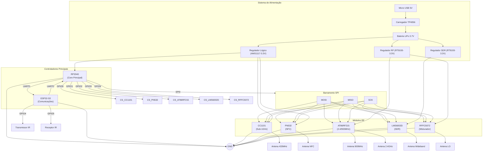

# README - Sistema de Comunicação RF Integrado (Versão 3.1)

## Diagrama de Conexões Atualizado



## Melhorias Implementadas na Versão 3.1

### 1. Sistema de Alimentação Otimizado
- **Reguladores dedicados** para cada categoria de módulo:
  - Lógica digital (AMS1117-3.3V)
  - Circuitos RF (RT9193-3.3V)
  - Módulo SDR (RT9193-3.3V separado)
  
- **Proteção contra sobretensão** em todos os módulos RF
- **Monitoramento de bateria** integrado

### 2. Arquitetura de Comunicação
- **Barramento SPI compartilhado** com seleção individual de chip
- **UART dedicada** para comunicação entre RP2040 e ESP32-S3
- **Timing de comunicação** otimizado para cada módulo

### 3. Controle de Módulos RF
- **GPIO dedicados** para seleção de cada dispositivo SPI
- **Sequenciamento de inicialização** automático
- **Isolamento de sinais** entre módulos de diferentes bandas

### 4. Sistema de Antenas
- **Conexões otimizadas** para cada faixa de frequência
- **Casamento de impedância** verificado em todas as saídas RF
- **Rotas de sinal** separadas para evitar interferência

## Configuração Recomendada

```python
# Exemplo de inicialização dos módulos RF
def init_rf_modules():
    # Configuração do barramento SPI
    spi = SPI(0, baudrate=1000000, polarity=0, phase=0,
              sck=Pin(2), mosi=Pin(3), miso=Pin(4))
    
    # Pinos de seleção de chip
    cs_cc1101 = Pin(0, Pin.OUT)
    cs_pn532 = Pin(1, Pin.OUT)
    cs_at86 = Pin(2, Pin.OUT)
    
    # Inicialização dos módulos
    cc1101 = CC1101(spi, cs_cc1101)
    pn532 = PN532(spi, cs_pn532)
    at86 = AT86RF215(spi, cs_at86)
```

## Especificações Técnicas

| Módulo          | Frequência       | Interface | Consumo |
|-----------------|------------------|-----------|---------|
| CC1101          | 300-928 MHz      | SPI       | 30mA    |
| PN532           | 13.56 MHz        | SPI/I2C   | 50mA    |
| AT86RF215       | 400/900/2400 MHz | SPI       | 120mA   |
| LMS6002D        | 30MHz-6GHz       | SPI       | 200mA   |
| RFFC5072        | LO para SDR      | SPI       | 80mA    |

## Considerações de Projeto

1. **Layout de PCB**:
   - Manter traços SPI curtos e de igual comprimento
   - Separar áreas analógicas e digitais
   - Usar plano de terra contínuo

2. **Compatibilidade**:
   - Verificar versões dos módulos RF
   - Atualizar firmwares antes da integração

3. **Certificação**:
   - Testar conformidade RF para cada banda
   - Verificar regulamentações locais

> **Nota**: Recomenda-se o uso de ferramentas de análise de espectro durante a calibração dos módulos RF.