## **Objetivos do Projeto**

1. **Desenvolvimento de um SDR Modular Avançado**

   * Controlado por **RP2040** (Raspberry Pi Pico 2W) e **ESP32-S3 DevKit**.
   * Capacidade de **recepção e transmissão de sinais RF** em múltiplas faixas:

     * HF: 15–30 MHz
     * Sub-1 GHz
     * RF: 30 MHz–6 GHz
   * Uso de front-ends específicos por faixa:

     * **LFCN-1000+** → 1 GHz (Sub-1 GHz)
     * **DEA165150HT-8025C2** → 30 MHz–6 GHz
     * **HF Front-End** → 15–30 MHz
   * Mixer / PLL central **RFFC5072A** para conversão e IF.

2. **Sincronização e Clock**

   * Uso de **TCXO 26 MHz** com buffer de clock para:

     * RP2040 (XIN/XOUT)
     * RFFC5072A (REF IN)
     * AT86RF215 (TCXO Input)

3. **Comunicação e Controle**

   * **RP2040** controla todos os módulos via GPIO, SPI, I2C e UART.
   * **ESP32-S3** para interface adicional e processamento paralelo.
   * Comunicação com NFC via **PN532** (SPI/I2C/UART).

4. **Modularidade e Expansão**

   * Cada front-end e módulo (Mixer/PLL, Modem, Clock, NFC) como **sub-graph/componentes** separados.
   * Capacidade de adicionar módulos adicionais sem refazer o núcleo de controle.

5. **Interface RF**

   * Saídas para **SMA Edge connectors** para antenas.
   * Filtros e LPFs integrados para proteger circuitos e garantir sinais limpos.

---

## **Status Atual (O que já foi feito)**

* Estrutura do projeto definida:

  * Sub-graphs para RP2040, ESP32, Clock, Mixer, Modem, NFC, Front-Ends.
* Conexões de alimentação mapeadas (3.3 V e GND).
* Conexões de clock configuradas para todos os módulos.
* RFFC5072A detalhado com entradas, saídas, IF, LO e filtros.
* Front-ends nomeados corretamente (DEA165150HT, LFCN-1000+, HF FE) e conectores SMA atribuídos.
* PN532 e AT86RF215 integrados com interfaces de comunicação e alimentação.

---

## **O que falta ser feito**

1. **Detalhamento completo das conexões dos pinos de cada módulo com RP2040 e ESP32**

   * Incluindo cada sinal de controle, IF, LO e SPI/I2C.
   * Mapear pinos NC → GND.

2. **Integração completa do fluxo RF**

   * RF Sub-1 GHz, 30 MHz–6 GHz, HF 15–30 MHz conectados aos mixers e ADCs corretamente.
   * IF dos mixers chegando no RP2040.

3. **Diagrama unificado**

   * Um único Mermaid ou PCB diagram com todos os módulos conectados.
   * Front-ends, Mixer/PLL, Clock System, Modem, MCU, NFC.

4. **Componentes de proteção e filtragem**

   * Capacitores, DC blocks, resistores de polarização.
   * Detalhamento de cada filtro e suas entradas/saídas.

5. **Testes de simulação e prototipagem**

   * Verificação de alimentação, comunicação SPI/I2C/UART.
   * Testes RF com sinais reais para cada faixa.

6. **Documentação para EasyEDA / PCB**

   * Nomes de componentes padronizados.
   * Sub-graphs convertidos em netlist ou esquema elétrico.

```mermaid
graph TD
    %% ============= MÓDULO DE ENERGIA =============
    subgraph Power["🔋 Módulo de Energia"]
        USB_IN["Micro USB 5V"] --> FUSE["F1: Fusível 3A"]
        FUSE --> TP5100["U1: TP5100 (Carregador)"]
        TP5100 --> BAT["B1-B2: 18650 3.7V 6000mAh"]
        BAT --> MP1584["U2: MP1584EN (3.3V)"]
        MP1584 --> VCC_3V3["3.3V"]
        
        TP5100 --> LED_B["D1: LED Azul (Carga)"]
        TP5100 --> LED_G["D2: LED Verde (Completo)"]
        LED_B --> R1["R1: 330Ω"]
        LED_G --> R2["R2: 330Ω"]
        
        VCC_3V3 --> AP2114["U3: AP2114 (2.5V)"]
        VCC_3V3 --> LP5907["U4: LP5907 (1.2V)"]
        
        %% Capacitores
        C1["C1: 10μF 25V"] --> TP5100
        C2["C2: 100nF"] --> TP5100
        C3["C3: 22μF"] --> MP1584
        C4["C4: 100nF"] --> MP1584
        C5["C5: 10μF"] --> AP2114
        C6["C6: 100nF"] --> AP2114
        C7["C7: 1μF"] --> LP5907
        C8["C8: 100nF"] --> LP5907
    end

    %% ============= MÓDULO RF/SDR =============
    subgraph SDR["📡 Módulo RF/SDR"]
        RP2040["U5: RP2040"] -->|SPI| AT86RF215["U6: AT86RF215"]
        AT86RF215 --> RF09["J1: SMA Sub-1GHz"]
        AT86RF215 --> RF24["J2: SMA 2.4GHz"]
        
        %% Filtros e Matching
        L1["L1: 15nH"] --> MATCH1["Rede de Casamento"]
        C9["C9: 1.8pF"] --> MATCH1
        L2["L2: 5.6nH"] --> MATCH2["Rede de Casamento"]
        C10["C10: 1.2pF"] --> MATCH2
        
        %% TCXO
        Y1["Y1: TCXO 26MHz"] --> C11["C11: 12pF"]
        C11 --> GND
        Y1 --> C12["C12: 12pF"]
        C12 --> GND
    end

    %% ============= MÓDULO NFC/IR =============
    subgraph NFC["📲 Módulo NFC/IR"]
        PN532["U7: PN532"] --> ANT["Antena NFC"]
        ANT --> L3["L3: 1.5μH"]
        ANT --> C13["C13: 27pF"]
        ANT --> C14["C14: 27pF"]
        
        %% Circuito IR
        IR_TX["Q1: TSAL6200"] --> R3["R3: 33Ω"]
        IR_RX["U8: VS1838B"] --> R4["R4: 10kΩ"]
        IR_RX --> C15["C15: 100nF"]
    end

    %% ============= MÓDULO DE CONTROLE =============
    subgraph Control["🎛️ Módulo de Controle"]
        STM32["U9: STM32H743"] --> OLED["U10: SSD1306"]
        STM32 --> BTN1["S1: Botão tátil"]
        STM32 --> BTN2["S2: Botão tátil"]
        STM32 --> LED1["D3: LED Verde"]
        LED1 --> R5["R5: 330Ω"]
        
        %% EEPROM
        EEPROM["U11: 24LC256"] --> R6["R6: 4.7kΩ"]
        EEPROM --> R7["R7: 4.7kΩ"]
    end

    %% ============= CONEXÕES =============
    VCC_3V3 --> SDR
    VCC_3V3 --> NFC
    VCC_3V3 --> Control
    GND --> SDR
    GND --> NFC
    GND --> Control
    
    STM32 -->|SPI| RP2040
    STM32 -->|I2C| PN532
```

