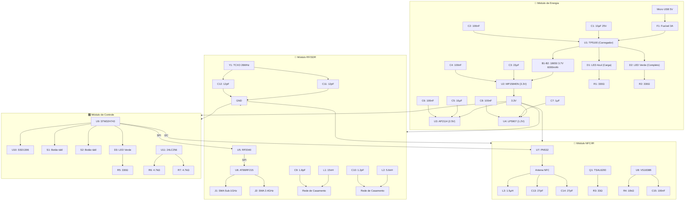

## **Objetivos do Projeto**

1. **Desenvolvimento de um SDR Modular Avançado**

   * Controlado por **RP2040** (Raspberry Pi Pico 2W) e **ESP32-S3 DevKit**.
   * Capacidade de **recepção e transmissão de sinais RF** em múltiplas faixas:

     * HF: 15–30 MHz
     * Sub-1 GHz
     * RF: 30 MHz–6 GHz
   * Uso de front-ends específicos por faixa:

     * **LFCN-1000+** → 1 GHz (Sub-1 GHz)
     * **DEA165150HT-8025C2** → 30 MHz–6 GHz
     * **HF Front-End** → 15–30 MHz
   * Mixer / PLL central **RFFC5072A** para conversão e IF.

2. **Sincronização e Clock**

   * Uso de **TCXO 26 MHz** com buffer de clock para:

     * RP2040 (XIN/XOUT)
     * RFFC5072A (REF IN)
     * AT86RF215 (TCXO Input)

3. **Comunicação e Controle**

   * **RP2040** controla todos os módulos via GPIO, SPI, I2C e UART.
   * **ESP32-S3** para interface adicional e processamento paralelo.
   * Comunicação com NFC via **PN532** (SPI/I2C/UART).

4. **Modularidade e Expansão**

   * Cada front-end e módulo (Mixer/PLL, Modem, Clock, NFC) como **sub-graph/componentes** separados.
   * Capacidade de adicionar módulos adicionais sem refazer o núcleo de controle.

5. **Interface RF**

   * Saídas para **SMA Edge connectors** para antenas.
   * Filtros e LPFs integrados para proteger circuitos e garantir sinais limpos.

---

## **Status Atual (O que já foi feito)**

* Estrutura do projeto definida:

  * Sub-graphs para RP2040, ESP32, Clock, Mixer, Modem, NFC, Front-Ends.
* Conexões de alimentação mapeadas (3.3 V e GND).
* Conexões de clock configuradas para todos os módulos.
* RFFC5072A detalhado com entradas, saídas, IF, LO e filtros.
* Front-ends nomeados corretamente (DEA165150HT, LFCN-1000+, HF FE) e conectores SMA atribuídos.
* PN532 e AT86RF215 integrados com interfaces de comunicação e alimentação.

---

## **O que falta ser feito**

1. **Detalhamento completo das conexões dos pinos de cada módulo com RP2040 e ESP32**

   * Incluindo cada sinal de controle, IF, LO e SPI/I2C.
   * Mapear pinos NC → GND.

2. **Integração completa do fluxo RF**

   * RF Sub-1 GHz, 30 MHz–6 GHz, HF 15–30 MHz conectados aos mixers e ADCs corretamente.
   * IF dos mixers chegando no RP2040.

3. **Diagrama unificado**

   * Um único Mermaid ou PCB diagram com todos os módulos conectados.
   * Front-ends, Mixer/PLL, Clock System, Modem, MCU, NFC.

4. **Componentes de proteção e filtragem**

   * Capacitores, DC blocks, resistores de polarização.
   * Detalhamento de cada filtro e suas entradas/saídas.

5. **Testes de simulação e prototipagem**

   * Verificação de alimentação, comunicação SPI/I2C/UART.
   * Testes RF com sinais reais para cada faixa.

6. **Documentação para EasyEDA / PCB**

   * Nomes de componentes padronizados.
   * Sub-graphs convertidos em netlist ou esquema elétrico.

