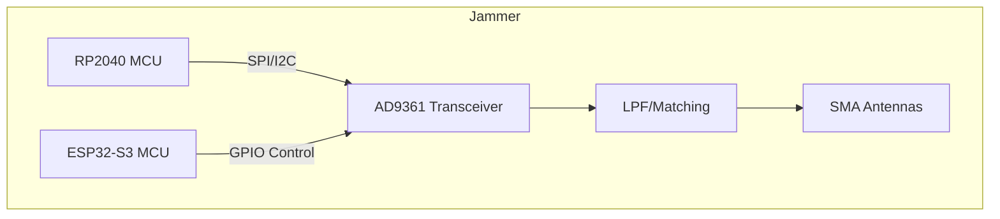
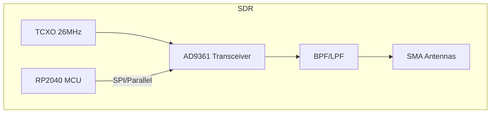
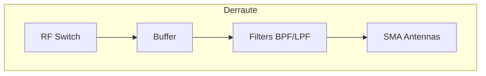
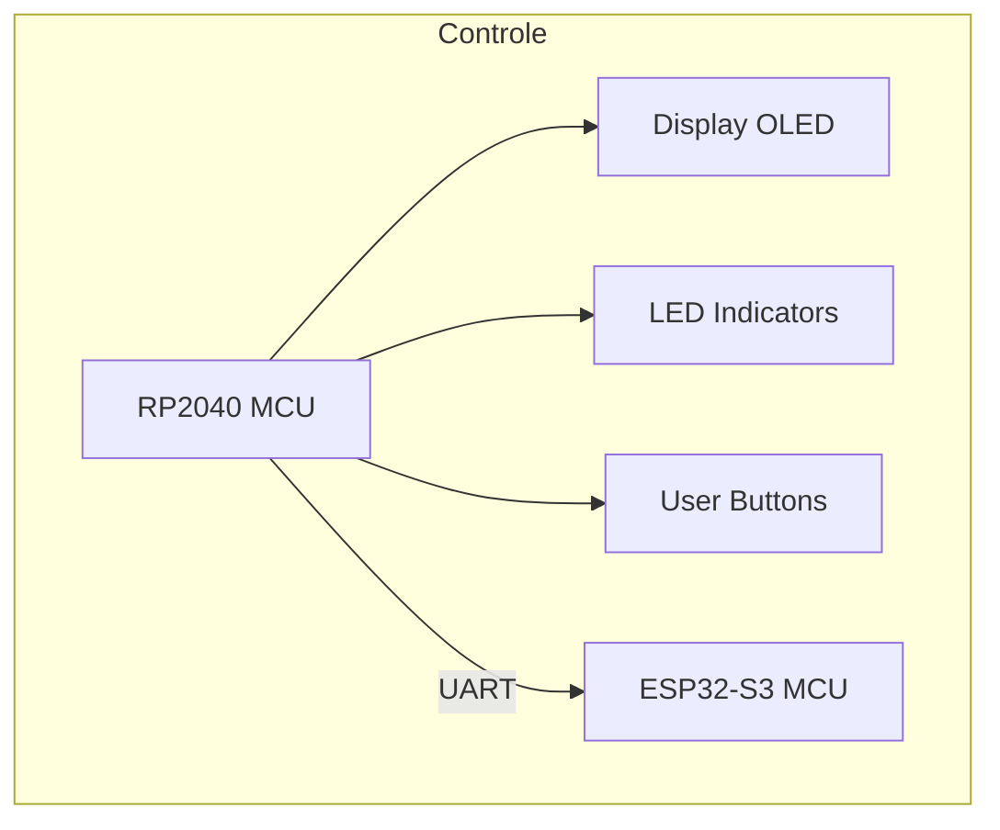

# **Relatório Técnico – Sistema SDR / Jammer / Derraute (Versão Otimizada)**

## 1️⃣ Visão Geral do Sistema

O sistema é dividido em **módulos PCB** para facilitar montagem, manutenção e expansão, mantendo máxima largura de banda e desempenho superior ao Hacker RF One e Flipper Zero.

**Arquitetura Modular**:

| Módulo               | Função                             | Observação                                 |
| -------------------- | ---------------------------------- | ------------------------------------------ |
| Jammer               | Bloqueio de RF em múltiplas faixas | Full-duplex, controle via MCU              |
| SDR                  | Recepção/transmissão de sinais     | Faixa de 70 MHz–6 GHz, AD9361 custom       |
| Derraute / RF Switch | Gerenciamento de caminhos de sinal | Permite roteamento entre antenas e filtros |
| Antenas              | Emissão/recepção                   | SMA, LPF/BPF integrados para cada faixa    |
| Controle             | MCU + Interface                    | RP2040 e ESP32-S3 em conjunto              |

**Objetivo do projeto**:

* Cobrir faixa mais ampla que o Flipper Zero e Hacker RF One (\~15 MHz a 6 GHz).
* Modularização por PCB para testes e manutenção.
* Alta eficiência energética e baixo ruído em RF.
* Integração com interface física (OLED, botões, LEDs) e comunicação entre MCUs.

---

## 2️⃣ Levantamento de Componentes

### **Módulo Jammer**

| Componente      | Quantidade | Função                   | Observação                                |
| --------------- | ---------- | ------------------------ | ----------------------------------------- |
| AD9361          | 1          | Transceptor SDR          | Recriado na PCB, full-duplex 70 MHz–6 GHz |
| RP2040          | 1          | Controle de lógica       | SPI/I²C para AD9361, UART para ESP32      |
| ESP32-S3        | 1          | Sequenciamento de jammer | Controle IR, GPIO extra                   |
| SAW/BPF Filters | 4–6        | Filtragem de saída       | Faixa dedicada: 1GHz, 2.4GHz, HF, etc.    |
| LPF/Matching    | 4–6        | Adaptador de antena      | 50 Ω                                      |
| Conectores SMA  | 4          | Antenas                  | Cada faixa independente                   |

---

### **Módulo SDR**

| Componente            | Quantidade | Função                | Observação                     |
| --------------------- | ---------- | --------------------- | ------------------------------ |
| AD9361                | 1          | Recepção/transmissão  | Same as Jammer, custom PCB     |
| TCXO 26 MHz           | 1          | Clock                 | PLL interno AD9361             |
| Capacitores/Indutores | vários     | Decoupling e filtros  | 10nF, 100nF, 1µF, L1-L3        |
| MCU (RP2040)          | 1          | Controle de streaming | SPI LVDS/Parallel para ADC/DAC |

---

### **Módulo Derraute / RF Switch**

| Componente  | Quantidade | Função               | Observação                                     |
| ----------- | ---------- | -------------------- | ---------------------------------------------- |
| RF Switch   | 2–4        | Roteamento de sinais | SPDT / SP4T por faixa                          |
| Filtros BPF | 4–6        | Limitação de faixa   | Cada faixa separada: HF, 1 GHz, 2.4 GHz, 5 GHz |
| Buffers     | 2          | Ganho e isolamento   | Reduz perda de sinal entre módulos             |
| SMA         | 4          | Entrada / saída      | Faixas independentes                           |

---

### **Módulo Antenas**

| Componente     | Quantidade | Função       | Observação                   |
| -------------- | ---------- | ------------ | ---------------------------- |
| Antena HF      | 1          | 15–30 MHz    | Conectada via filtro LPF     |
| Antena Sub-GHz | 1          | 300–1000 MHz | Conectada via filtro BPF/LPF |
| Antena 2.4 GHz | 1          | 2.4–2.5 GHz  | SMA dedicada                 |
| Antena 5–6 GHz | 1          | 5–6 GHz      | SMA dedicada                 |

---

## 3️⃣ Diagramas Modulares (Mermaid)

### **Módulo Jammer**

### **Módulo SDR**

### **Módulo Derraute / RF Switch**

### **Módulo Controle / Interface**

---

## 4️⃣ Otimizações Implementadas

* Substituição de reguladores lineares por **buck converters** para eficiência.
* Divisão clara de **módulos PCB** (SDR, Jammer, Derraute, Controle, Antenas).
* Cada faixa de frequência possui **filtro dedicado** (LPF/BPF) para minimizar interferência.
* Roteamento de sinal em **50 Ω** para alta integridade.
* Clock centralizado via **TCXO 26 MHz** para sincronização precisa.
* MCU mestre definido: **RP2040** para interface e lógica, ESP32-S3 para periféricos IR e sequenciamento.
* PN532 migrado para barramento I²C/SPI compartilhado.

---

## 5️⃣ Levantamento de GPIO / Conexões

| MCU      | GPIO Disponíveis | Funções atribuídas                                                  |
| -------- | ---------------- | ------------------------------------------------------------------- |
| RP2040   | 26 (GP0–GP26)    | SPI AD9361, I²C NFC, UART ESP32, ADC IF\_IN, Controle LEDs e Botões |
| ESP32-S3 | 47               | Sequenciamento Jammer, IR, PWM, GPIO expansíveis                    |

**Observação**: Planejar pinout global antes do layout final para evitar conflitos.

---

## 6️⃣ Orçamento Aproximado (USD / unidade)

| Componente                  | Qtd | Valor Unitário | Total |
| --------------------------- | --- | -------------- | ----- |
| AD9361 Custom               | 1   | 120            | 120   |
| RP2040                      | 1   | 5              | 5     |
| ESP32-S3                    | 1   | 10             | 10    |
| TCXO 26 MHz                 | 1   | 2              | 2     |
| Filtros LPF/BPF             | 10  | 3              | 30    |
| SMA Conectores              | 10  | 1              | 10    |
| Buffers/Amplifiers          | 4   | 4              | 16    |
| Capacitores/Indutores       | 20  | 0.2            | 4     |
| Buck Converter              | 2   | 3              | 6     |
| Misc (Headers, PCB 4-layer) | -   | -              | 30    |

**Total estimado**: \~\$233 por unidade (sem considerar mão de obra e prototipagem).

---
