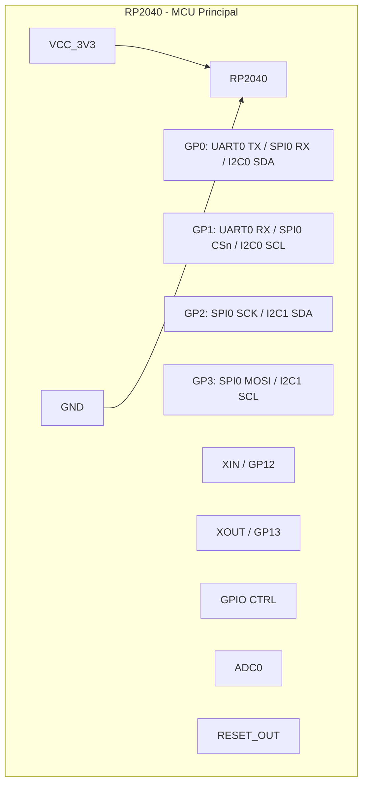
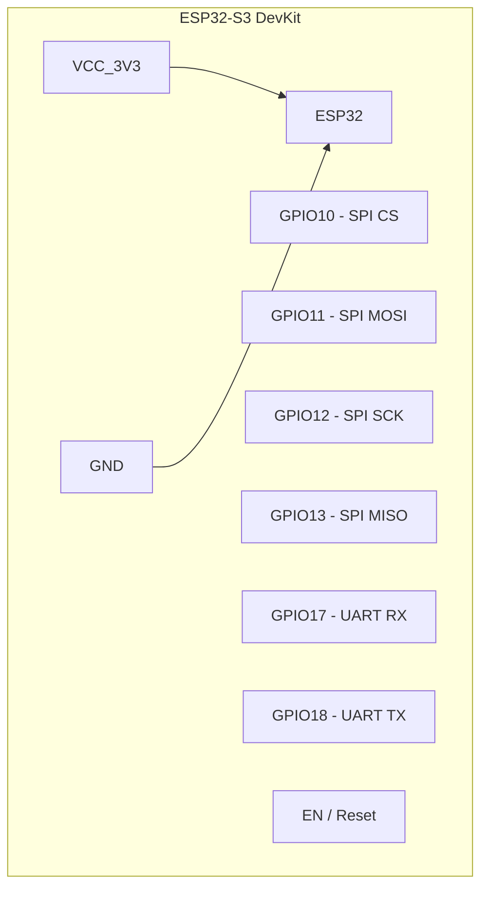
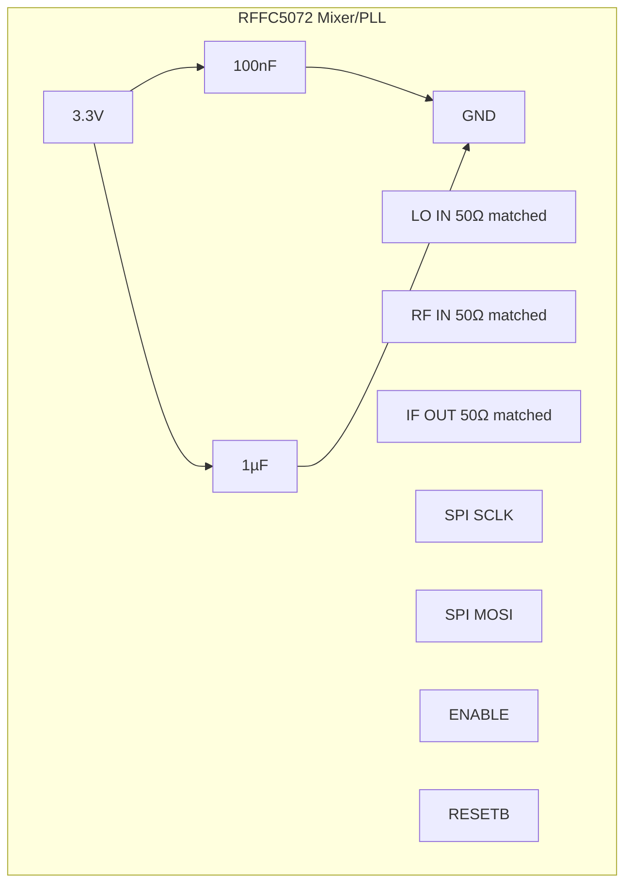
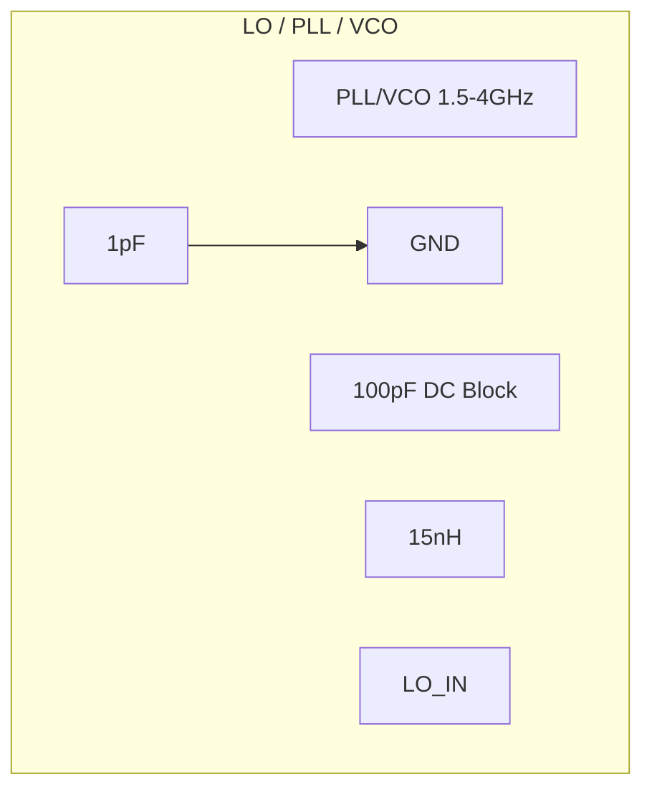
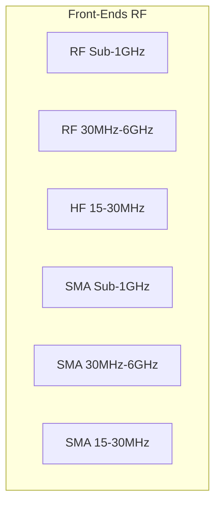
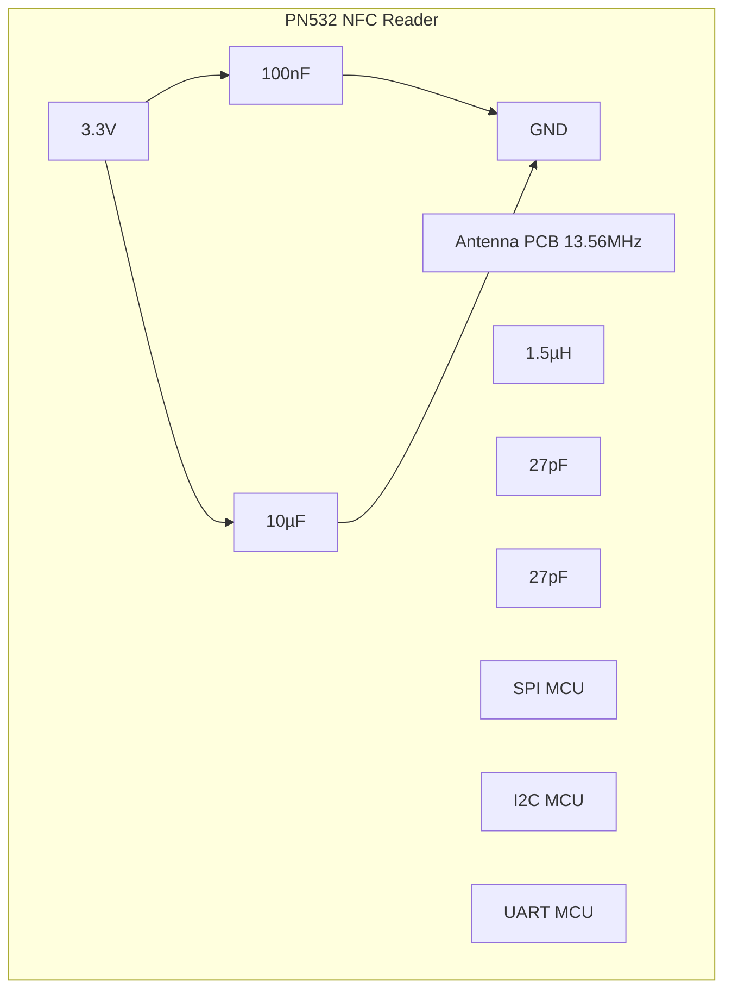
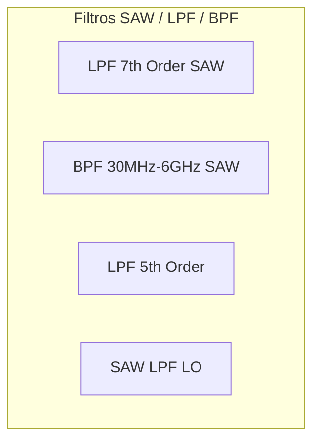

Perfeito! Vamos organizar em duas partes:

1. **Diagramas individuais de cada módulo** (subgraphs separados com todos os componentes).
2. **Diagrama geral de interconexão** entre os módulos.

---

## **1️⃣ Diagramas Individuais de Módulos**

---

## **2️⃣ Diagrama de Conexões Entre Módulos**

```mermaid
graph TD
    %% Alimentação
    VCC_3V3 --> MCU_RP2040
    VCC_3V3 --> MCU_ESP32
    VCC_3V3 --> MIXER_RFFC5072
    VCC_3V3 --> LO_Module
    VCC_3V3 --> RF_FrontEnds
    VCC_3V3 --> PN532_Module

    GND --> MCU_RP2040
    GND --> MCU_ESP32
    GND --> MIXER_RFFC5072
    GND --> LO_Module
    GND --> RF_FrontEnds
    GND --> PN532_Module

    %% Clock
    TCXO["26MHz TCXO"] --> MCU_RP2040_GP12
    TCXO --> MCU_RP2040_GP13
    TCXO --> MIXER_RFFC5072
    TCXO --> AT86RF215

    %% RP2040 -> Mixer / Front-End
    MCU_RP2040_GP0 --> MIXER_RFFC5072_SCLK
    MCU_RP2040_GP3 --> MIXER_RFFC5072_SDATA
    MCU_RP2040_GP22 --> MIXER_RFFC5072_ENBL
    MCU_RP2040_GP22 --> MIXER_RFFC5072_RESET

    %% Mixer -> Filtros -> Front-End
    MIXER_RFFC5072_LO_IN --> LO_Module
    MIXER_RFFC5072_RF_IN --> RF_FrontEnds_RF_6GHz
    MIXER_RFFC5072_IF_OUT --> FILTERS_FL3 --> MCU_RP2040_GP26

    %% RP2040 -> ESP32
    MCU_RP2040_GP0 --> MCU_ESP32_GPIO17
    MCU_RP2040_GP1 --> MCU_ESP32_GPIO18

    %% PN532 -> MCU
    PN532_Module_SPI_MCU --> MCU_RP2040_GP0
    PN532_Module_I2C_MCU --> MCU_RP2040_GP1
    PN532_Module_UART_MCU --> MCU_RP2040_GP0
```

