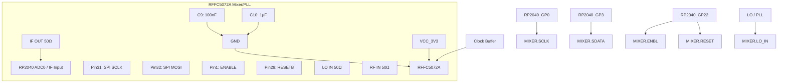
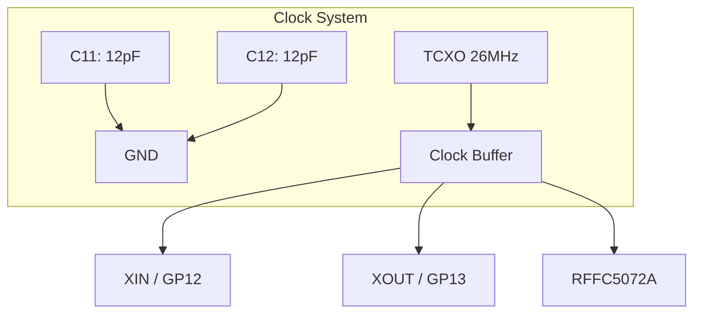
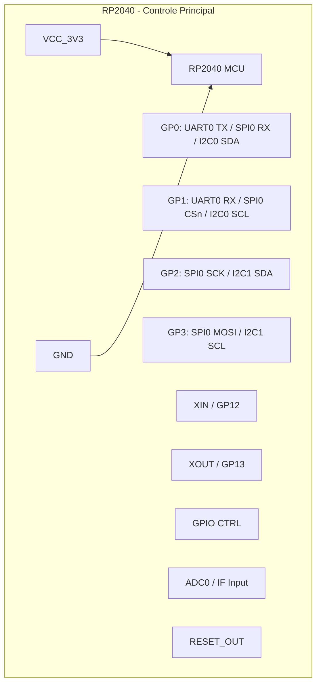
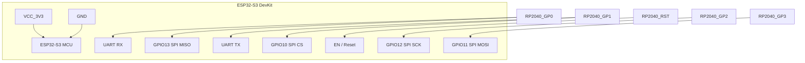
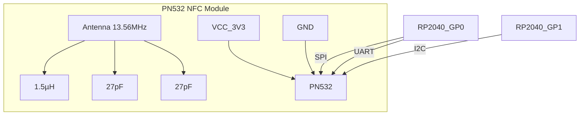

### **1️⃣ Módulo RFFC5072A Mixer/PLL**

---

### **2️⃣ Módulo TCXO + Clock Buffer**

---

### **3️⃣ Módulo RP2040 (Controle Principal)**

---

### **4️⃣ Módulo ESP32-S3 DevKit**

---

### **5️⃣ Módulo NFC PN532**

---

# Diagrama de interconcexão 

```mermaid
graph TD
    %% =============================
    %% ALIMENTAÇÃO
    %% =============================
    VCC_3V3[3.3V Power Rail]
    GND[GND]

    %% =============================
    %% MCU RP2040
    %% =============================
    subgraph MCU_RP2040["RP2040 - Controle Principal"]
        RP2040["RP2040 MCU"]
        RP2040_GP0["GP0: UART0 TX / SPI0 RX / I2C0 SDA"]
        RP2040_GP1["GP1: UART0 RX / SPI0 CSn / I2C0 SCL"]
        RP2040_GP2["GP2: SPI0 SCK / I2C1 SDA"]
        RP2040_GP3["GP3: SPI0 MOSI / I2C1 SCL"]
        RP2040_GP12["XIN / GP12"]
        RP2040_GP13["XOUT / GP13"]
        RP2040_GP22["GPIO CTRL"]
        RP2040_GP26["ADC0 / IF Input"]
        RP2040_RST["RESET_OUT"]

        VCC_3V3 --> RP2040
        GND --> RP2040
    end

    %% =============================
    %% MCU ESP32-S3
    %% =============================
    subgraph MCU_ESP32["ESP32-S3 DevKit"]
        ESP32["ESP32-S3 MCU"]
        ESP32_GPIO10["GPIO10 SPI CS"]
        ESP32_GPIO11["GPIO11 SPI MOSI"]
        ESP32_GPIO12["GPIO12 SPI SCK"]
        ESP32_GPIO13["GPIO13 SPI MISO"]
        ESP32_GPIO17["UART RX"]
        ESP32_GPIO18["UART TX"]
        ESP32_EN["EN / Reset"]

        VCC_3V3 --> ESP32
        GND --> ESP32
    end

    %% =============================
    %% CLOCK SYSTEM
    %% =============================
    subgraph CLOCK_SYS["Clock System"]
        TCXO["TCXO 26MHz"]
        C11["C11: 12pF"] --> GND
        C12["C12: 12pF"] --> GND
        TCXO --> CLK_BUF["Clock Buffer"]
        VCC_3V3 --> TCXO
        GND --> TCXO
        VCC_3V3 --> CLK_BUF
        GND --> CLK_BUF
    end

    %% =============================
    %% MIXER RFFC5072A
    %% =============================
    subgraph MIXER_SYS["RFFC5072A Mixer/PLL"]
        MIXER["RFFC5072A"]
        SCLK["Pin31: SPI SCLK"]
        SDATA["Pin32: SPI MOSI"]
        ENBL["Pin1: ENABLE"]
        RESET["Pin29: RESETB"]
        LO_IN["LO IN 50Ω"] --> FL1["LPF 7th Order SAW"]
        RF_IN["RF IN 50Ω"] --> FL2["BPF 30MHz-6GHz SAW"]
        IF_OUT["IF OUT 50Ω"] --> FL3["LPF 5th Order"] --> RP2040_GP26
        C9["C9: 100nF"] --> GND
        C10["C10: 1µF"] --> GND
        VCC_3V3 --> MIXER
        GND --> MIXER
    end

    %% =============================
    %% LOCAL OSCILLATOR
    %% =============================
    subgraph LO_SYS["Local Oscillator / PLL"]
        PLL["PLL/VCO 1.5-4GHz"] --> C_LO["100pF DC Block"] --> L_LO["15nH"] --> MIXER.LO_IN
        C_GND["1pF"] --> GND
        VCC_3V3 --> PLL
        GND --> PLL
    end

    %% =============================
    %% FRONT-END RF
    %% =============================
    subgraph FRONT_END["RF Front-Ends"]
        RF_SUB1G["RF Sub-1GHz"] --> SMA_SUB1G["SMA Sub-1GHz"]
        RF_6GHz["RF 30MHz-6GHz"] --> SMA_6GHz["SMA 30MHz-6GHz"]
        HF_FE["HF 15-30MHz"] --> SMA_HF["SMA 15-30MHz"]
        VCC_3V3 --> RF_SUB1G
        VCC_3V3 --> RF_6GHz
        VCC_3V3 --> HF_FE
        GND --> RF_SUB1G
        GND --> RF_6GHz
        GND --> HF_FE
    end

    %% =============================
    %% PN532 NFC
    %% =============================
    subgraph NFC_SYS["PN532 NFC Module"]
        PN532["PN532"]
        ANT["Antenna 13.56MHz"] --> L1["1.5µH"] 
        ANT --> C1["27pF"]
        ANT --> C2["27pF"]
        VCC_3V3 --> PN532
        GND --> PN532
    end

    %% =============================
    %% CONEXÕES ENTRE MÓDULOS
    %% =============================
    %% Clock
    CLK_BUF --> MIXER
    CLK_BUF --> RP2040_GP12
    CLK_BUF --> RP2040_GP13

    %% SPI / GPIO RP2040 <-> Mixer
    RP2040_GP0 --> MIXER.SCLK
    RP2040_GP3 --> MIXER.SDATA
    RP2040_GP22 --> MIXER.ENBL
    RP2040_GP22 --> MIXER.RESET

    %% IF ADC
    MIXER.IF_OUT --> RP2040_GP26

    %% UART RP2040 <-> ESP32
    RP2040_GP0 --> ESP32_GPIO17
    RP2040_GP1 --> ESP32_GPIO18
    RP2040_RST --> ESP32_EN

    %% SPI RP2040 <-> ESP32
    RP2040_GP2 --> ESP32_GPIO12
    RP2040_GP3 --> ESP32_GPIO11
    RP2040_GP0 --> ESP32_GPIO13
    RP2040_GP1 --> ESP32_GPIO10

    %% NFC Interface
    RP2040_GP0 -->|SPI| PN532
    RP2040_GP1 -->|I2C| PN532
    RP2040_GP0 -->|UART| PN532

```

