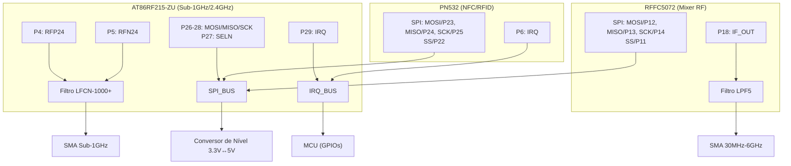
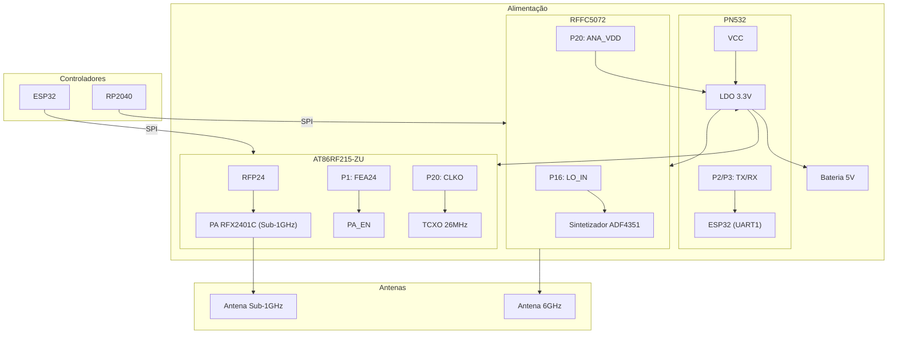
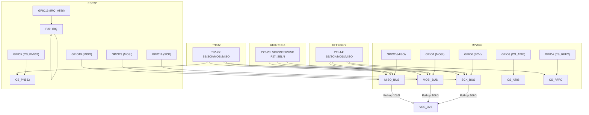

Aqui estão os três diagramas Mermaid solicitados, com detalhamento completo de pinagens e conexões:

---

### **1. Diagrama de Integração AT86RF215-ZU + PN532 + RFFC5072**

---

### **2. Diagrama de Conexões com Componentes Externos**

---

### **3. Conexões com RP2040 e ESP32**

---

### **Detalhes Críticos:**
1. **Compatibilidade de Níveis Lógicos**:
   - Todos os módulos operam em 3.3V (checar se PN532 suporta 5V).
   - Usar *level shifters* se necessário (ex: ESP32 ↔ PN532).

2. **SPI Compartilhado**:
   - Cada módulo deve ter um pino CS dedicado.
   - Configurar *clock speed* adequado (ex: AT86RF215 suporta até 10MHz).

3. **Gerenciamento de IRQ**:
   - Priorizar IRQ do AT86RF215 (baixa latência para comunicações RF).

4. **Alimentação**:
   - Separar trilhas de 3.3V para RF (filtradas com LC) e digital.

5. **Antenas**:
   - Impedância controlada (50Ω) e afastamento de fontes de ruído.
