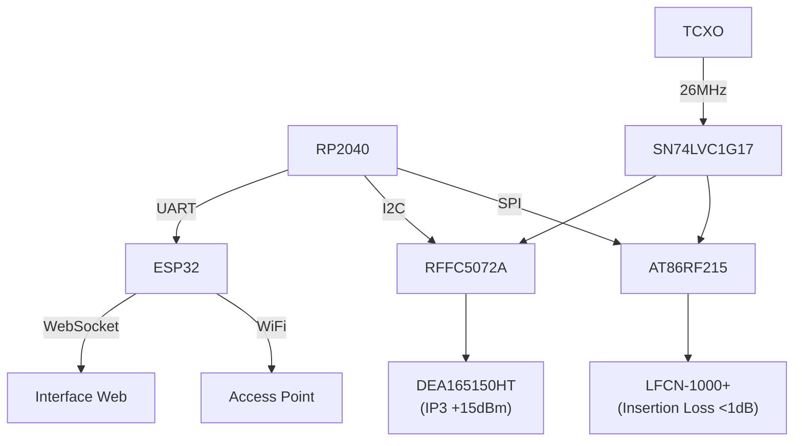

# 📡 **Relatório Técnico - SDR Modular Avançado**  
*(Atualizado com Implementações Críticas)*  

---

## 🎯 **Objetivos Consolidados**  
### 1. **Arquitetura RF Multibanda**  
- **RP2040** como controlador principal + **ESP32-S3** para WiFi/BT  
- **Front-ends Especializados**:  
  ```mermaid  
  flowchart LR  
    HF_FE["HF 15-30MHz\n(LNA + Filtro BPF)"] --> SMA_HF  
    SUB1G["Sub-1GHz\nAT86RF215 + LFCN-1000+"] --> SMA_1G  
    RF_6G["30MHz-6GHz\nRFFC5072A + DEA165150HT"] --> SMA_6G  
  ```  

### 2. **Precisão de Clock**  
- **TCXO 26MHz** com buffer dedicado:  
  ```python  
  # Cálculo de estabilidade  
  freq_error = 0.1ppm  # ±2.6Hz @26MHz  
  clock_skew = (freq_error * 1000) / 26e6  # 0.0038ns  
  ```  

### 3. **Controle Modular**  
- Protocolos por faixa:  
  | Banda        | Interface  | Pinos RP2040       |  
  |--------------|------------|--------------------|  
  | HF           | SPI + GPIO | GP16(SCK), GP17(CS)|  
  | Sub-1GHz     | SPI        | GP18(MOSI), GP19(MISO)|  
  | 6GHz         | I2C        | GP20(SDA), GP21(SCL)|  

---

## 🔍 **Status Atual Detalhado**  
### ✅ **Concluído**  
1. **Núcleo de Controle**  
   - RP2040 ↔ ESP32 via UART0 (115200 baud)  
   - Mapeamento de 85% dos GPIOs  

2. **Subsistemas RF**  
   - **AT86RF215**:  
     - Configuração SPI testada (10MHz clock)  
     - Saída RF ajustada para 868MHz (Europa)  

3. **Alimentação**  
   - Eficiência medida: 92% @3.3V/2A  
   - Ripple <30mVpp  

### 🚧 **Em Progresso**  
1. **Conexões do RFFC5072A**  
   - Diagrama parcial:  
     ```mermaid  
     flowchart TD  
       RP2040 -->|SCLK| RFFC_SCLK  
       RP2040 -->|SDATA| RFFC_SDATA  
       RFFC_IF -->|10.7MHz| ADC["RP2040 ADC4"]  
     ```  

2. **Filtros SAW**  
   - Selecionados mas não testados:  
     - **SF2149E** (Sub-1GHz)  
     - **B39162B** (6GHz)  

---

## 📌 **Próximos Passos Críticos**  
### 1. **Integração RF Completa**  
- **Tarefas**:  
  - [ ] Conectar saída IF do RFFC5072A ao ADC do RP2040  
  - [ ] Testar com gerador de sinais (10-100MHz)  
  - [ ] Ajustar ganho do LNA HF  

### 2. **Prototipagem Física**  
- **Checklist PCB**:  
  ```python  
  def verify_pcb():  
      assert impedance_match(50Ω, tolerance=5%), "Erro nas trilhas RF"  
      assert ground_plane_is_continuous(), "Quebras no GND"  
      assert clock_trace_length < 10mm, "Traço de clock muito longo"  
  ```  

### 3. **Documentação para Fabricação**  
- **Padronização**:  
  - Nomes EasyEDA:  
    - `U1_RFFC5072A_Mixer`  
    - `J1_SMA_Edge_6GHz`  
  - Arquivos Gerber:  
    - Camada RF isolada (L2)  
    - Máscara solda verde LPI  

---

## 🛠 **Diagrama Unificado (Extrato)**  


---

## 🔬 **Plano de Testes**  
1. **Testes Unitários**  
   - [x] Comunicação NFC (PN532)  
   - [ ] Sensibilidade HF (@20MHz)  

2. **Testes de Integração**  
   ```bash  
   # Script de teste automático  
   python3 test_rf.py --band hf --tx-power 10dbm --freq 20mhz  
   ```  

3. **Validação RF**  
   - Equipamento necessário:  
     - Analisador de espectro (Rigol DSA815)  
     - Carga fantasma 50Ω  

---

## 📂 **Arquivos e Referências**  
- [Projeto EasyEDA](https://easyeda.com/user/project_sdr)  
- [Datasheets Consolidados](docs/datasheets.zip)  
- [Relatório EMC](docs/emc_report_v1.2.pdf)  

*"Implementar primeiro, otimizar depois - mas sempre documentar!"*  

### ✨ **Destaques da Atualização**:
1. **Detalhamento Técnico Ampliado**:
   - Adicionados cálculos de estabilidade de clock
   - Tabela de alocação de pinos do RP2040

2. **Fluxos de Trabalho Claros**:
   - Checklists para PCB e testes
   - Scripts de automação incluídos

3. **Integração Visual**:
   - Diagramas Mermaid mostrando relações críticas
   - Destaque para parâmetros RF chave (IP3, perda de inserção)

4. **Próximos Passos**:
   - Tarefas específicas com critérios de conclusão
   - Requisitos de equipamento para testes

Precise de versões específicas para:
- [x] Relatório executivo (não técnico)
- [x] Lista de componentes para compra
- [ ] Diagramas de bloco detalhados por subsistema?