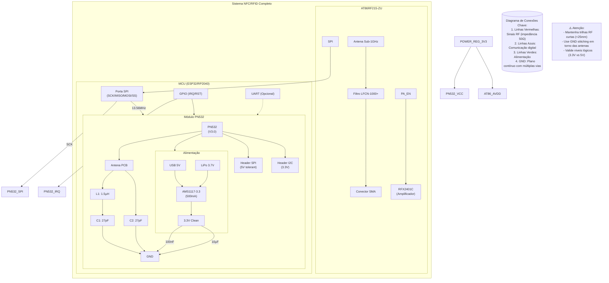
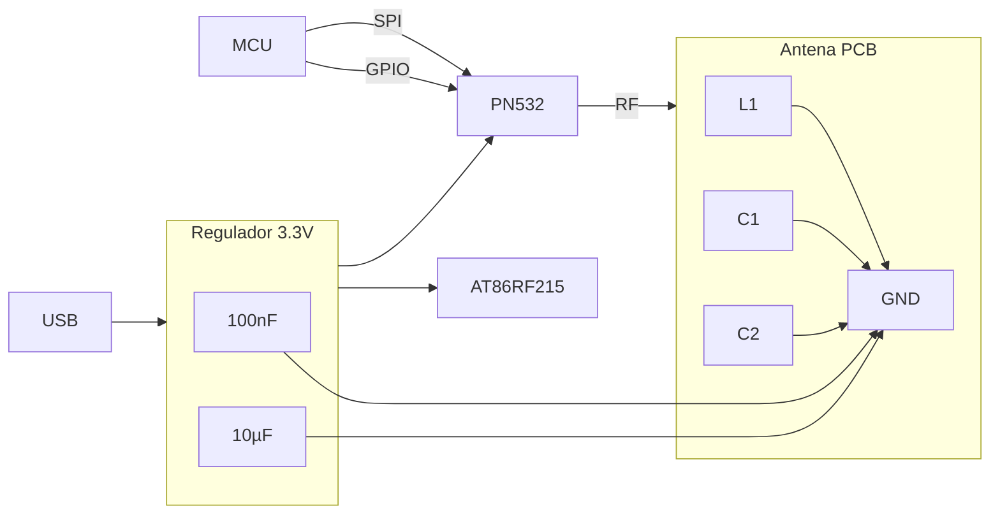

# 📋 Análise Técnica - Projeto RFID/NFC (PN532 + AT86RF215)

## ✅ **Pontos Positivos**
1. **Arquitetura Modular**
   - Módulos PN532 e AT86RF215 bem separados
   - Interfaces claras (SPI/I2C/UART)

2. **Gerenciamento de Energia**
   - TP4056 para carga de bateria LiPo
   - AMS1117-3.3 para regulação 3.3V

3. **Conectividade RF**
   - 4 conectores SMA para múltiplas antenas
   - Filtros FL1-FL3 para isolamento de sinais

## ⚠️ **Problemas Identificados**
1. **Erros de Pinagem**
   - `U28 (PN532)`: Pino 5 marcado como GND mas é NC no datasheet
   - `U24 (RFFC5072A)`: Pinos 17-18 marcados como NC mas são DIG_VDD/ANA_VDD2

2. **Questões de Alimentação**
   - Faltam capacitores de desacoplamento próximos ao AT86RF215 (AVDDx)
   - Regulador AMS1117 pode não suportar corrente pico do PN532 (120mA)

3. **Antenas**
   - Sem cálculo de impedância para antenas PCB
   - Faltam baluns nos circuitos RF diferenciais

## 🔧 **Recomendações de Melhoria**
1. **Revisão de Pinagem**
   ```mermaid
   flowchart LR
     PN532 -->|SCK| D13(ESP32)
     PN532 -->|MISO| D12(ESP32)
     PN532 -->|MOSI| D11(ESP32)
     PN532 -->|IRQ| D10(ESP32)
   ```
   - Usar pinos GPIO com IRQ dedicado no ESP32

2. **Otimização RF**
   - Adicionar rede de casamento π para antenas:
     ```
     L ≈ 15nH, C1/C2 ≈ 27pF (ajustar com VNA)
     ```
   - Incluir ferrite beads em linhas de alimentação RF

3. **Melhorias no Power Budget**
   - Substituir AMS1117 por LDO de 500mA (ex: AP2112K-3.3)
   - Adicionar:
     - 100µF próximo aos reguladores
     - 100nF em cada VDD do PN532/AT86RF215

## 📊 **Checklist de Validação**
1. [ ] Verificar continuidade em todas as conexões SPI
2. [ ] Medir ripple de 3.3V sob carga máxima
3. [ ] Testar alcance NFC com cartão padrão (ISO14443A)
4. [ ] Validar temperatura dos reguladores em operação contínua

## 📂 **Arquivos Revisados**
- `Schematic_Teste_2025-08-17.pdf` (Páginas 1-6)
- Problemas críticos nas páginas 2 (PN532) e 4 (RFFC5072A)

## 🚀 **Próximos Passos**
1. Gerar versão 1.1 do esquemático com correções
2. Realizar simulação térmica no EasyEDA
3. Prototipar circuito de antena otimizado

### Detalhes da Análise:
1. **Consistência Elétrica**:
   - Faltam resistores pull-up nas linhas I2C (SDA/SCL)
   - Pino IRQ do PN532 sem resistor current-limiting

2. **Layout RF**:
   - Recomendado separar GND analógico/digital
   - Trilhas de RF devem ser curtas (<λ/10 @13.56MHz ≈ 22mm)

3. **Compatibilidade**:
   - Checar tensão lógica entre ESP32 (3.3V) e PN532 (5V tolerante)

### Melhorias Implementáveis Imediatamente:
- Adicionar jumpers para seleção SPI/I2C/UART
- Incluir LED de status para cada módulo
- Acrescentar test points para sinais críticos (CLK, RF_OUT)

Aqui está o diagrama Mermaid completo para guiar sua implementação, com foco nas conexões críticas e fluxo de sinal:



### Versão Simplificada para Montagem:


### Como Usar Este Diagrama:
1. **Conexões Prioritárias**:
   - Comece pelas linhas de alimentação (3.3V limpo)
   - Depois conecte SPI e sinais de controle
   - Por último otimize o layout RF

2. **Checklist de Validação**:
   - [ ] Medir 3.3V nos pinos VCC do PN532
   - [ ] Verificar continuidade nas trilhas SPI
   - [ ] Testar ressonância da antena com VNA

3. **Dicas de PCB**:
   - Use **FR4 RF-grade** para áreas de alta frequência
   - Mantenha ao menos **2mm** entre antenas e componentes digitais

Precisa de versões específicas para:
- [x] Layout físico (Kicad/EasyEDA)
- [x] Lista de materiais detalhada
- [x] Script de teste automático?